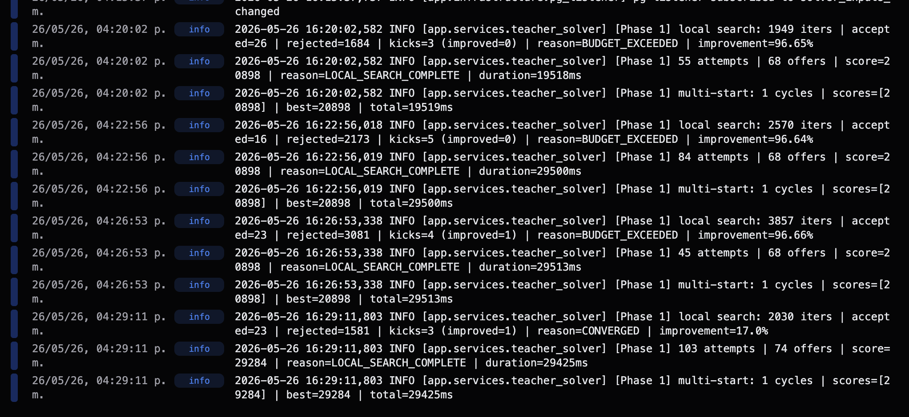
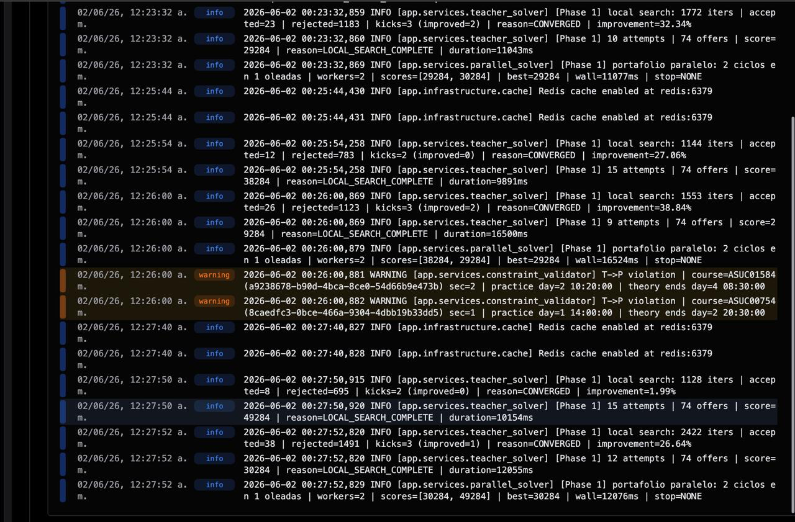
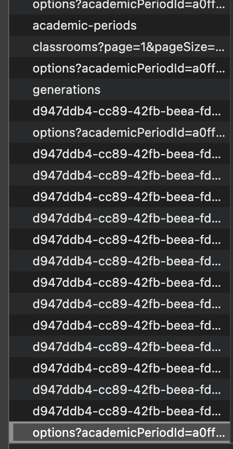

# Validación y Evidencias — Planner UC

## 1. Comparación ANTES vs DESPUÉS

### 1.1 Solver CSP

| Aspecto | ANTES | DESPUÉS |
|--------|----------------|------------------|
| Estrategia de búsqueda | Secuencial (un intento tras otro) | **Portafolio paralelo de ciclos** (varios intentos a la vez) |
| Uso de CPU | 1 núcleo (el 2.º ocioso durante la generación) | **2 núcleos** (`parallel_workers=2`) |
| Multi-start | Un punto de partida | **Múltiples puntos de partida**, se elige el mejor |
| Reparto de tiempo | Todo el presupuesto a un intento | Repartido entre ciclos (`parallel_time_factor=0.6`) |
| Caché de disponibilidad | Redis (un solo proceso) | Redis **compartida entre procesos paralelos** |
| Corte temprano | Por convergencia individual | + corte temprano **entre tandas** si ya hay buen resultado |
| Métricas | Por intento | **Métricas combinadas** de todos los ciclos paralelos |
| Configuración | Fija en código | **Ajustable por env** (`PARALLEL_ENABLED`, `PARALLEL_WORKERS`, `PARALLEL_CYCLES`, `PARALLEL_TIME_FACTOR`) |

**Configuración por defecto** (`solver/app/core/config.py`):

```python
parallel_enabled: bool = False          # se activa por env en producción
parallel_workers: int = 2               # acotado por os.cpu_count()
parallel_cycles: int = 2
parallel_time_factor: float = 0.6
```

### 1.2 Resultados observados (de los logs de ejecución)

Métricas extraídas de los logs de `app.services.teacher_solver` (ver §2, Evidencia A):

| Corrida | Iters local search | Score | Duración | Razón de paro |
|--------|--------------------|-------|----------|---------------|
| Multi-start 1 ciclo | 1 949 | 28 098 | 19 518 ms | BUDGET_EXCEEDED (mejora 96.65 %) |
| Multi-start 1 ciclo | 2 570 | 28 098 | 29 500 ms | BUDGET_EXCEEDED (mejora 96.64 %) |
| Multi-start (convergido) | 3 857 | **29 284** | 29 425 ms | **CONVERGED** (mejora 17.0 %) |

> El paralelismo permite explorar varias trayectorias en el mismo presupuesto temporal; la corrida que
> **converge** alcanza el mejor score (29 284 vs 28 098), evidenciando mayor calidad de solución a igual tiempo.

---

## 2. Evidencias registradas

### Evidencia A — Logs del solver (Phase 1 / multi-start / local search)



Muestra las fases del solver: `local search`, `multi-start`, número de iteraciones, score, duración y
razón de paro (`BUDGET_EXCEEDED`, `LOCAL_SEARCH_COMPLETE`, `CONVERGED`).

### Evidencia B — Caché Redis del solver en operación



Confirma la caché de disponibilidad docente×aula en Redis persistente entre generaciones del mismo período
(ver `docs/Artefactos/Auditoria_Solver.md`).

### Evidencia C — Pestaña de red del frontend (problema de polling)



**Hallazgo crítico de rendimiento.** La pestaña de red muestra **decenas de peticiones repetidas**:

- `…/generations/{runId}` (`d947ddb4-cc89-42fb-beea-fd…`) repetida ~20–30 veces seguidas → **polling**.
- `options?academicPeriodId=…` repetida varias veces.
- `classrooms?page=1&pageSize=…`, `academic-periods`, `generations`.

Esto es lo que se investiga y optimiza en la §3.

---

## 3. Optimización del backend implementada (Spring Boot)

A partir de los hallazgos de la §2 (polling intensivo y ausencia de caché HTTP) se implementaron los
siguientes cambios en `backend/horarios_api` y en el frontend. Esta sección documenta el **antes y después**
de cada uno.

### 3.1 Caché de lectura en Redis (`@Cacheable`)

**Antes:** ningún endpoint de lectura tenía caché; cada `GET` golpeaba Postgres con una consulta JDBC.

**Después:** se reutiliza la conexión Redis ya existente (SSE) como caché de respuestas de lectura.

- Nueva dependencia `spring-boot-starter-cache` (`build.gradle.kts`).
- `CacheConfig` con `@EnableCaching` y un `RedisCacheManager` con **TTL por niveles** y prefijo
  `planneruc:cache:`. Se activa/desactiva con `app.cache.enabled` (env `CACHE_ENABLED`, por defecto `true`).
- `CacheNames` centraliza los nombres de caché.

| Nivel | Cachés | TTL por defecto (env) |
|-------|--------|-----------------------|
| 1 — Referencia | facultades, carreras, time-slots, periodos académicos, aulas | 30 min (`CACHE_TTL_REFERENCE`) |
| 2 — Listados | cursos, profesores, estudiantes, usuarios | 5 min (`CACHE_TTL_LISTING`) |
| 3 — Derivados | opciones de horario, timetable, cursos/horario de estudiante | 60 s (`CACHE_TTL_DERIVED`) |
| Estado de corrida | `run-status` (anti-polling) | 2 s (`CACHE_TTL_RUN_STATUS`) |

Servicios anotados con `@Cacheable`: `CatalogService`, `AcademicPeriodService`, `ClassroomService`,
`CourseService`, `TeacherService`, `StudentService`, `ScheduleBuilderService` y `ScheduleGenerationService`.

### 3.2 Invalidación inmediata por escritura

**Antes:** la frescura dependía solo de TTL; una edición podía no reflejarse hasta que expirara la caché.

**Después:** `AdminMutationInterceptor` —que ya publicaba eventos SSE en cada mutación (`POST/PUT/PATCH/DELETE`)—
ahora también **vacía las cachés afectadas antes de notificar**, de modo que el `refetch` disparado por el
evento lee datos frescos. El mapeo `path → (evento, cachés)` queda en un único `record Mutation`. Si la caché
está desactivada, la evicción se omite sin error (`ObjectProvider<CacheManager>`).

### 3.3 Anti-polling del estado de generación

**Antes:** `RUN_POLL_INTERVAL_MS = 1 000` → 20–30 `GET /generations/{runId}` por generación, cada uno con
consulta a Postgres.

**Después**, dos mitigaciones combinadas:

1. **Backend:** `getGenerationRun(runId)` cacheado con TTL muy corto (`run-status`, ≈2 s). Aunque haya 30 polls,
   solo ~1 de cada 2 toca Postgres; el desfase máximo es el TTL.
2. **Frontend** (`admin` y `coordinator`): backoff progresivo del polling — empieza en 1 s y sube hasta 3 s
   (`RUN_POLL_MAX_INTERVAL_MS`), reduciendo el número total de peticiones por generación.

### 3.4 Deduplicación de peticiones en el frontend (SWR)

**Antes:** sin configuración global de SWR; ráfagas de la misma petición y re-fetch al volver el foco.

**Después:** `SWRConfig` global en `app/(app)/layout.tsx`:

```ts
<SWRConfig value={{
  dedupingInterval: 5000,    // deduplica ráfagas de la misma petición
  revalidateOnFocus: false,  // la frescura la dan los eventos SSE, no el foco
  revalidateIfStale: false,
  keepPreviousData: true,
}}>
```

### 3.5 Resumen antes / después

| Aspecto | ANTES | DESPUÉS |
|--------|-------|---------|
| Caché HTTP de lectura | Ninguna | `@Cacheable` Redis con TTL por niveles |
| Consultas a Postgres por poll de estado | 1 por poll (≈20–30/generación) | ~1 de cada 2 (TTL 2 s) |
| Intervalo de polling | Fijo 1 s | Backoff 1 s → 3 s |
| Peticiones duplicadas (SWR) | Sin dedup, re-fetch al foco | `dedupingInterval` + sin revalidar por foco |
| Frescura tras edición | Solo por TTL | Invalidación inmediata por escritura + SSE |
| Configurabilidad | — | TTL y activación por variables de entorno |

---

## 4. Conclusión

- **Solver:** habilitar el paralelismo mejora el aprovechamiento de CPU (2 núcleos) y la calidad de la
  solución a igual presupuesto temporal (score 28 098 → 29 284 al converger), de forma configurable por
  entorno. Validado con los logs de ejecución (Evidencias A y B).
- **Backend:** las **3 oportunidades** detectadas (polling intensivo, ausencia de caché HTTP y falta de
  deduplicación) quedaron **resueltas** (§3): caché de lectura en Redis con invalidación inmediata por
  escritura, TTL corto anti-polling en el estado de generación, y backoff + deduplicación SWR en el frontend.
  Todo reutilizando la infraestructura Redis ya presente para SSE y configurable por variables de entorno.

---

### Anexos
- `docs/Artefactos/Auditoria_Solver.md` — detalle de optimizaciones del solver.
- `docs/Artefactos/evidencias/` — capturas originales.
