# Manual del Software — Planner UC

## Sistema de Generación Óptima de Horarios Académicos

**Versión del documento:** 1.1 (Markdown)  
**Fecha:** 26 de junio de 2026  
**Audiencia:** Administradores, coordinadores académicos y estudiantes

---

## Tabla de contenidos

1. [Introducción](#1-introducción)
2. [Acceso al sistema](#2-acceso-al-sistema)
3. [Navegación general](#3-navegación-general)
4. [Gestión de usuarios](#4-gestión-de-usuarios)
5. [Gestión de estudiantes](#5-gestión-de-estudiantes)
6. [Gestión de cursos](#6-gestión-de-cursos)
7. [Gestión de docentes](#7-gestión-de-docentes)
8. [Gestión de aulas](#8-gestión-de-aulas)
9. [Gestión de facultades y carreras](#9-gestión-de-facultades-y-carreras)
10. [Gestión de períodos académicos](#10-gestión-de-períodos-académicos)
11. [Generación de horarios (coordinador / administrador)](#11-generación-de-horarios-coordinador--administrador)
12. [Constructor y confirmación de horarios docentes](#12-constructor-y-confirmación-de-horarios-docentes)
13. [Vista estudiante — consulta y generación de horario](#13-vista-estudiante--consulta-y-generación-de-horario)
14. [Constructor manual de horario del estudiante](#14-constructor-manual-de-horario-del-estudiante)
15. [Mi perfil y cuenta](#15-mi-perfil-y-cuenta)
16. [Mi horario confirmado](#16-mi-horario-confirmado)
17. [Solución de problemas frecuentes](#17-solución-de-problemas-frecuentes)

---

## 1. Introducción

**Planner UC** es una aplicación web para la planificación, generación y gestión de horarios académicos.

| Rol | Descripción |
|:---|:---|
| **Administrador** | Gestión completa del catálogo y horarios institucionales. |
| **Coordinador** | Generación y ajuste de horarios por carrera. |
| **Estudiante** | Consulta de oferta, generación y confirmación de horario personal. |
| **Docente** | Consulta de horario asignado. |

---

## 2. Acceso al sistema

### 2.1 Iniciar sesión

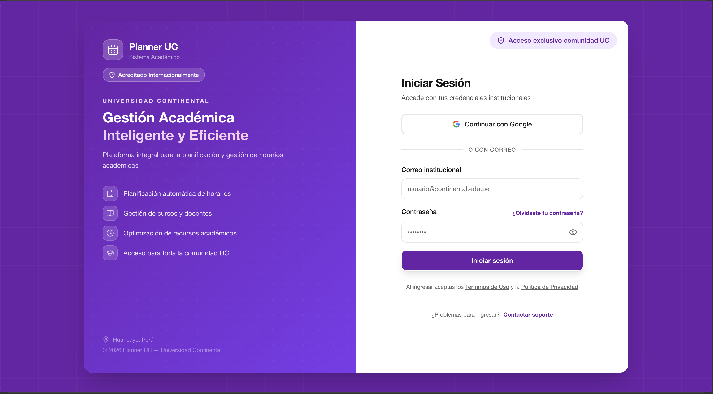

*Figura 2.1: Pantalla de inicio de sesión.*

1. Abra la URL de la aplicación.
2. Ingrese correo `@continental.edu.pe` y contraseña.
3. O use **Continuar con Google** con cuenta institucional.
4. Tras login exitoso, el sistema redirige según su rol.

### 2.2 Cerrar sesión

1. Clic en su **avatar** (barra lateral inferior).
2. Seleccione **Cerrar sesión**.

---

## 3. Navegación general

| Elemento | Función |
|:---|:---|
| **Barra lateral** | Módulos según rol |
| **Barra superior** | Búsqueda y notificaciones |
| **Área central** | Pantalla activa |

---

## 4. Gestión de usuarios

**Ruta:** `/admin/users` · **Rol:** Administrador

---

### 4.1 Pantalla principal — listado de usuarios

En este módulo se gestionan todas las cuentas del sistema. Para registrar un usuario nuevo, use el botón **Nuevo usuario** (esquina superior derecha).

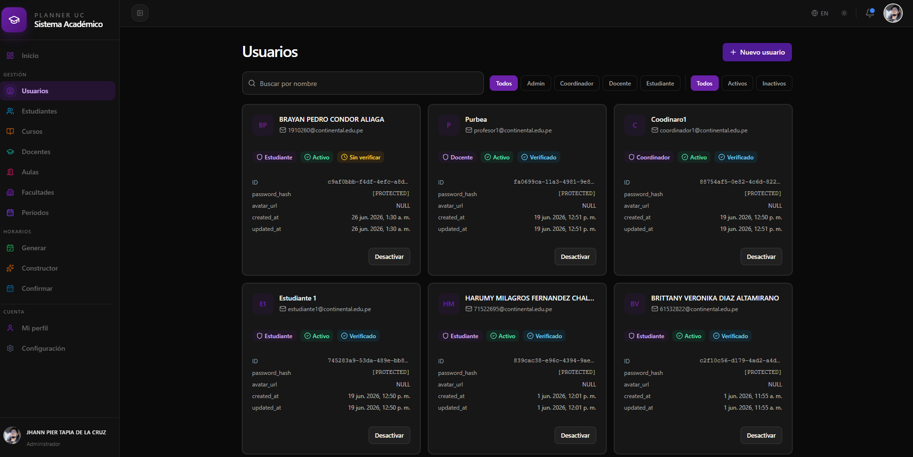

*Figura 4.1: Pantalla principal del módulo Usuarios.*

**Pasos:**

1. Inicie sesión como administrador.
2. En el menú lateral, haga clic en **Usuarios**.
3. Revise el listado con nombre, correo, rol y estado.

---

### 4.2 Crear un nuevo usuario

Complete todos los campos con información válida: correo, nombre completo y rol. La contraseña debe tener al menos 8 caracteres, incluir mayúscula, minúscula, número y carácter especial, sin espacios. Luego haga clic en **Crear usuario**.

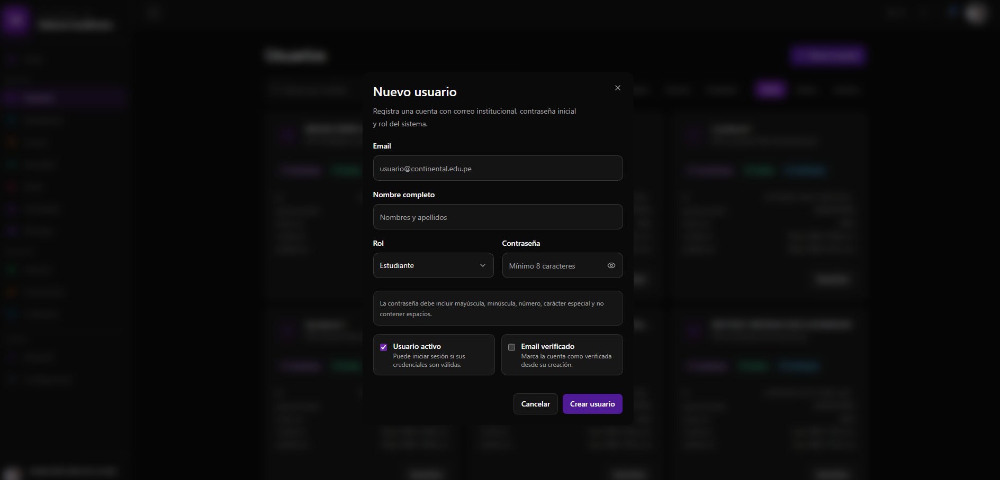

*Figura 4.2: Formulario de registro de usuario.*

**Campos del formulario:**

| Campo | Reglas |
|:---|:---|
| Email | `@continental.edu.pe` |
| Nombre completo | Obligatorio |
| Rol | Admin, Coordinador, Docente o Estudiante |
| Contraseña | 8+ caracteres, complejidad requerida |
| Usuario activo | Recomendado: Sí |

**Pasos:**

1. Clic en **Nuevo usuario**.
2. Complete el formulario (ver captura anterior).
3. Clic en **Crear usuario**.
4. Verifique el mensaje de confirmación.

---

### 4.3 Buscar, filtrar y desactivar usuarios

Una vez registrado, el usuario aparece en la lista. Puede buscarlo por nombre, filtrar por rol o estado, y desactivar cuentas inactivas.

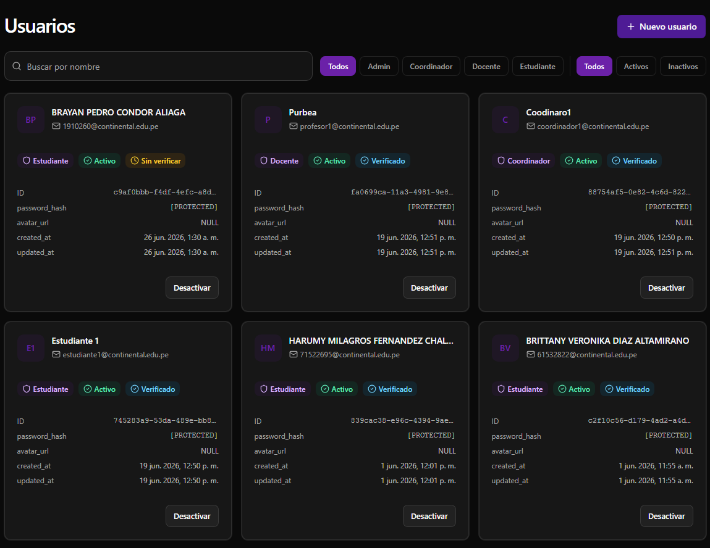

*Figura 4.3: Búsqueda, filtros y acciones sobre usuarios.*

**Pasos:**

1. Use **Buscar por nombre o correo…**
2. Abra **Filtros** → rol y estado (activos/inactivos).
3. Para desactivar: clic en **Desactivar** → confirme en el diálogo.

---

## 5. Gestión de estudiantes

**Ruta:** `/admin/students` · **Rol:** Administrador

---

### 5.1 Pantalla principal — listado de estudiantes

Para registrar un estudiante, haga clic en **Nuevo estudiante** (esquina superior derecha).

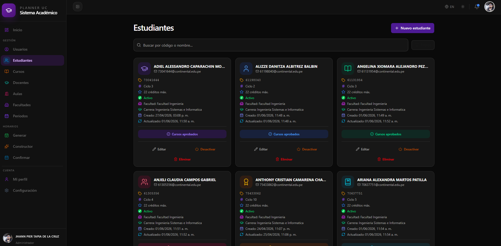

*Figura 5.1: Pantalla principal del módulo Estudiantes.*

**Pasos:**

1. Menú lateral → **Estudiantes**.
2. Revise las tarjetas con código, nombre, carrera y ciclo.

---

### 5.2 Registrar un nuevo estudiante

Complete: código (DNI), estado, nombres, apellidos, ciclo, límite de créditos, facultad y carrera. En *Buscar curso por código o nombre* agregue cursos aprobados (o déjelo vacío). Clic en **Crear estudiante**.

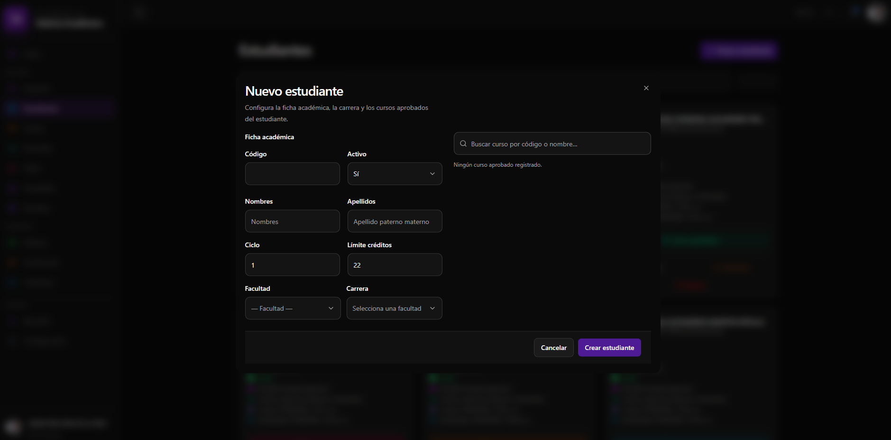

*Figura 5.2: Formulario de registro con ficha académica y cursos aprobados.*

**Pasos:**

1. Clic en **Nuevo estudiante**.
2. Complete **Ficha académica** (ver captura).
3. Agregue **cursos aprobados** si corresponde.
4. Clic en **Crear estudiante**.

---

### 5.3 Consultar, editar y administrar estudiantes

Desde el listado puede buscar por nombre o código, filtrar por carrera/ciclo/estado, editar, desactivar o eliminar registros.

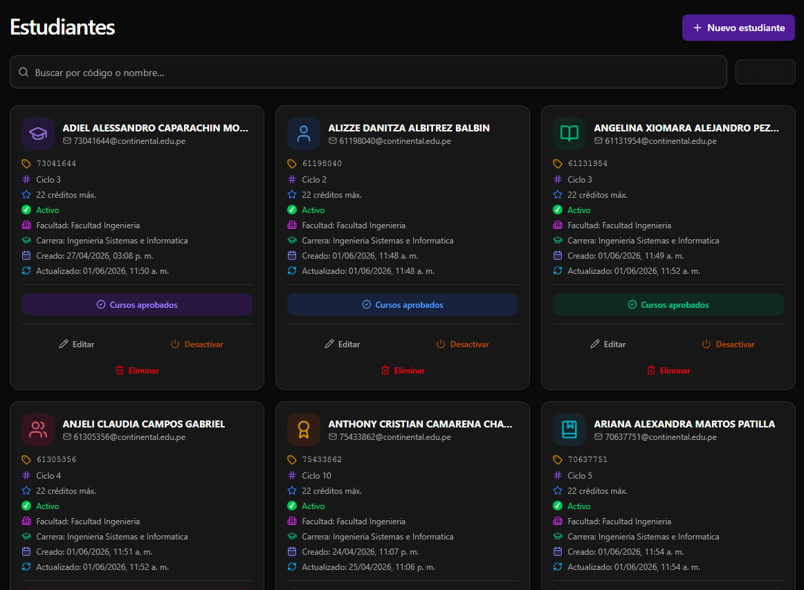

*Figura 5.3: Listado con filtros y acciones (Editar, Cursos aprobados, Desactivar).*

**Pasos:**

1. Busque o filtre al estudiante.
2. **Editar** → modifique datos → **Guardar**.
3. **Cursos aprobados** → agregue o quite cursos.
4. **Desactivar / Eliminar** → confirme en el diálogo.

---

## 6. Gestión de cursos

**Ruta:** `/admin/courses` · **Rol:** Administrador

---

### 6.1 Pantalla principal — listado de cursos

Para registrar un curso, haga clic en **Nuevo curso**.

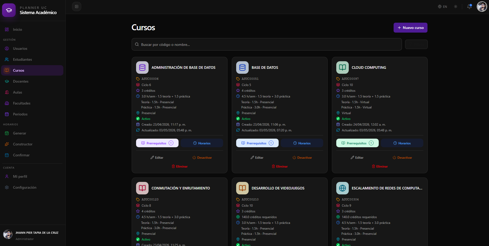

*Figura 6.1: Pantalla principal del módulo Cursos.*

**Pasos:**

1. Menú lateral → **Cursos**.
2. Revise código, nombre, créditos y estado de cada curso.

---

### 6.2 Crear un nuevo curso

Complete: código (ej. `ASUC0006`), estado, nombre, ciclo, créditos, horas semanales, créditos mínimos (si no hay prerrequisitos por curso), tipo de aula. Agregue prerrequisitos buscando por código o nombre. Clic en **Crear curso**.

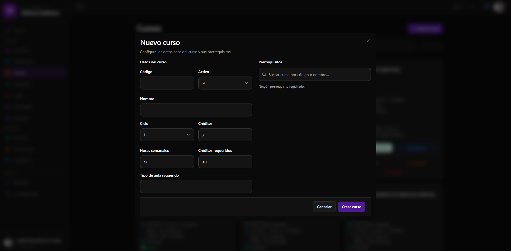

*Figura 6.2: Formulario de registro de curso con prerrequisitos.*

**Pasos:**

1. Clic en **Nuevo curso**.
2. Complete datos y prerrequisitos (ver captura).
3. Configure componentes (teoría/práctica) si aplica.
4. Clic en **Crear curso**.

---

### 6.3 Administrar cursos registrados

Busque por código o nombre. Filtre por estado, tipo de aula y rango de créditos. Edite, desactive o elimine desde cada tarjeta.

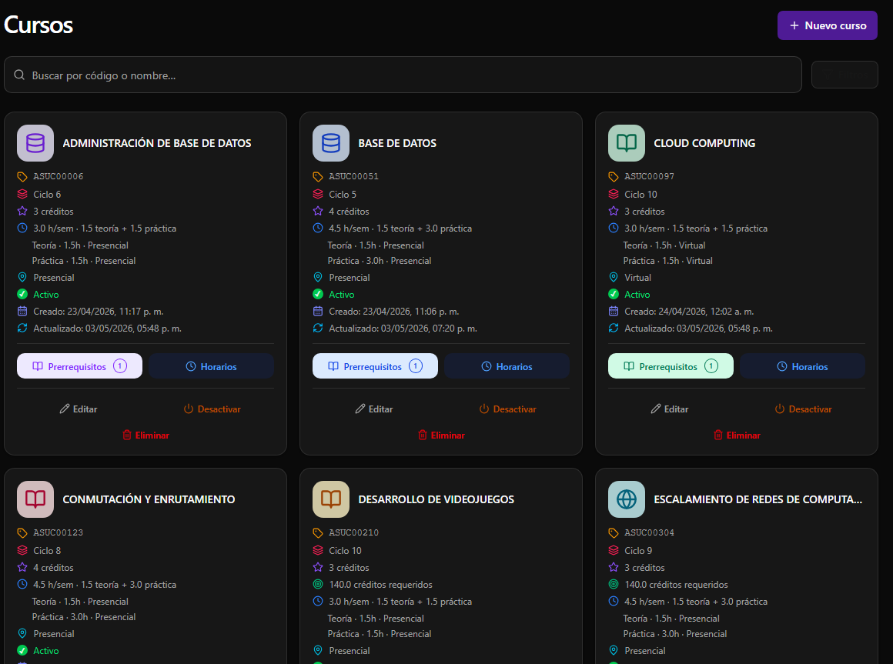

*Figura 6.3: Listado con filtros y acciones por curso.*

**Pasos:**

1. Use búsqueda y filtros.
2. Desde cada tarjeta: **Prerrequisitos**, **Componentes**, **Editar**, **Desactivar**.

---

### 6.4 Editar prerrequisitos

Si no registró prerrequisitos al crear el curso, puede hacerlo después desde la tarjeta del curso.

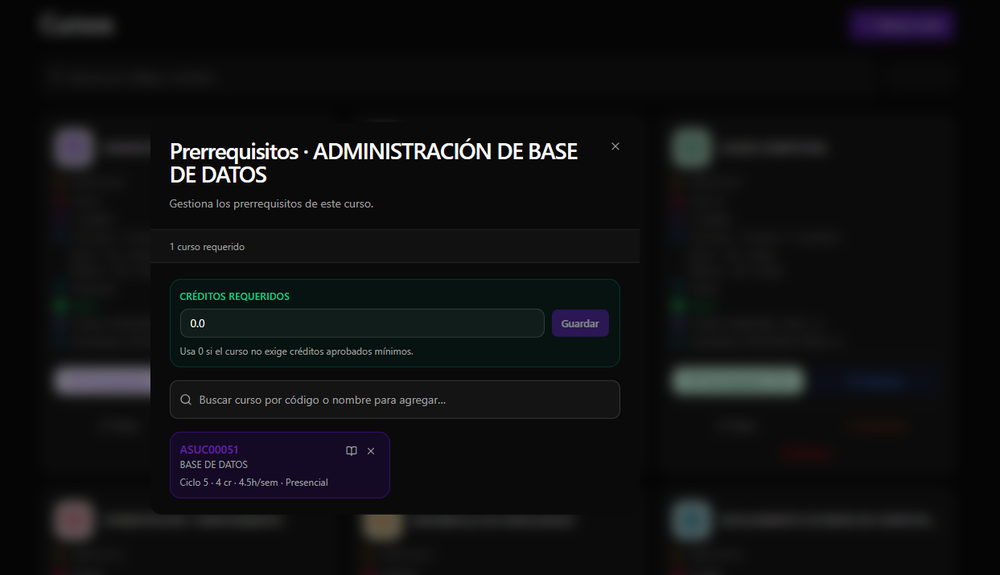

*Figura 6.4: Ventana para editar prerrequisitos y créditos requeridos.*

**Pasos:**

1. Clic en **Prerrequisitos** en la tarjeta del curso.
2. Busque y agregue cursos previos.
3. Ajuste créditos mínimos si corresponde.
4. Guarde.

---

### 6.5 Configurar componentes del curso

Defina la estructura de sesiones (teoría, práctica o general) que usará el solver.

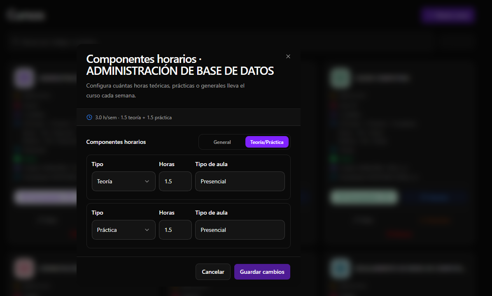

*Figura 6.5: Configuración de componentes y horario base del curso.*

**Pasos:**

1. Clic en **Componentes** (o *Horario base*).
2. Defina tipos y horas semanales.
3. Guarde.

---

## 7. Gestión de docentes

**Ruta:** `/admin/teachers` · **Rol:** Administrador

---

### 7.1 Pantalla principal — listado de docentes

Pantalla donde se observa toda la información referente a docentes.

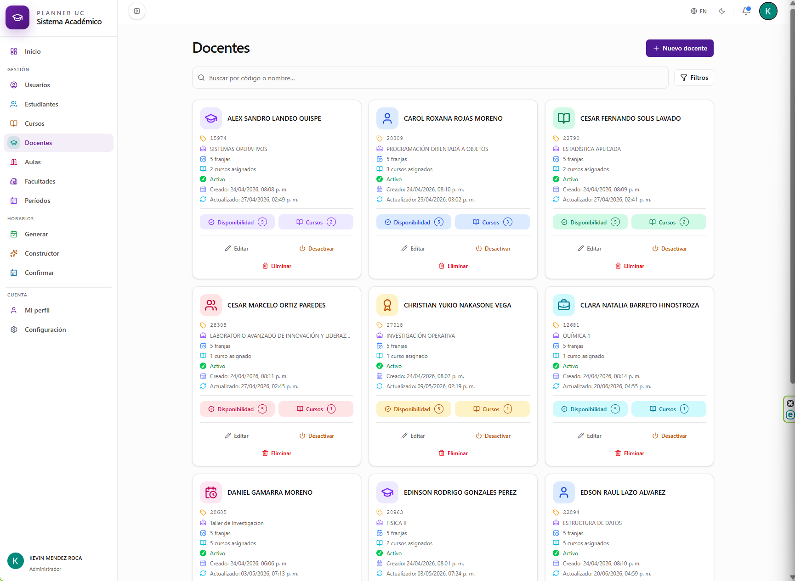

*Figura 7.1: Listado general de docentes.*

**Pasos:**

1. Menú lateral → **Docentes**.
2. Use la búsqueda para localizar un docente.

---

### 7.2 Crear un nuevo docente

Formulario de creación con todos los campos validados.

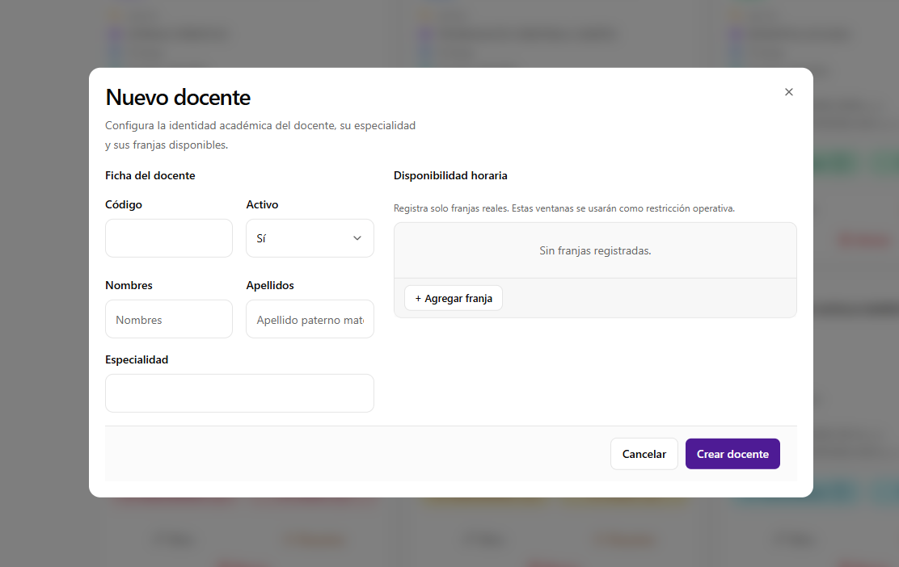

*Figura 7.2: Formulario de registro de docente.*

**Pasos:**

1. Clic en **Nuevo docente**.
2. Complete código, nombres, apellidos, estado y correo.
3. Clic en **Crear docente**.

---

### 7.3 Editar disponibilidad horaria

Formulario para indicar en qué franjas puede dictar clases cada docente.

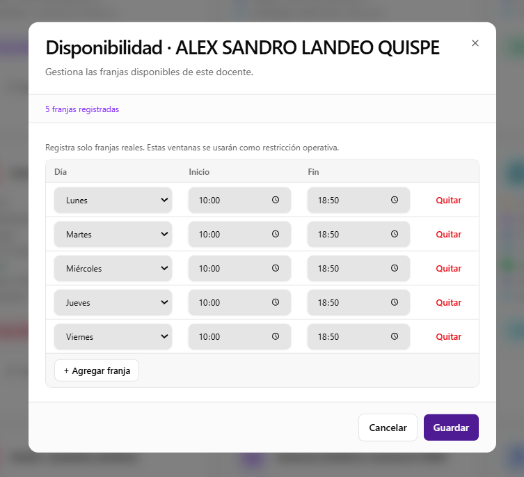

*Figura 7.3: Grilla de disponibilidad horaria del docente.*

**Pasos:**

1. En la tarjeta del docente → **Disponibilidad**.
2. Marque/desmarque bloques de día y hora.
3. Guarde.

---

### 7.4 Asignar cursos al docente

Formulario para indicar qué cursos y componentes puede dictar.

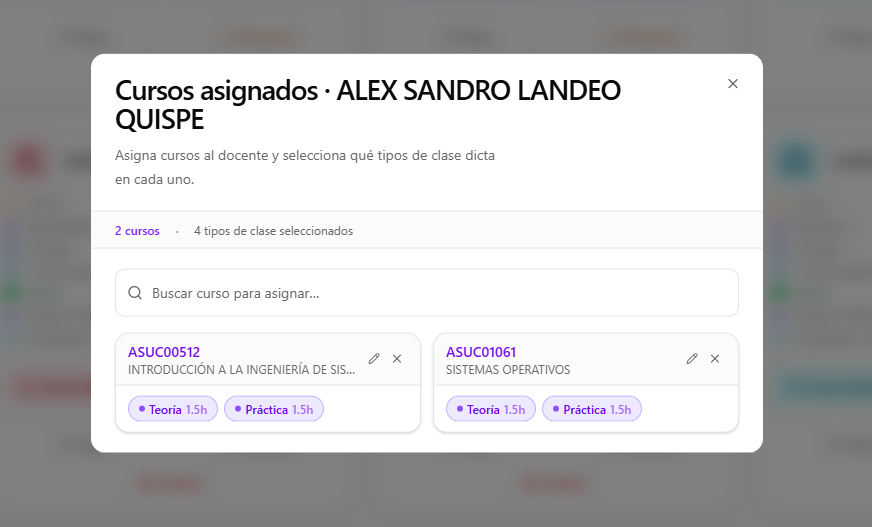

*Figura 7.4: Asignación de cursos y tipos de clase al docente.*

**Pasos:**

1. Clic en **Cursos asignados**.
2. Busque y agregue cursos.
3. Indique componente (teoría/práctica/general).
4. Guarde.

---

### 7.5 Editar datos del docente

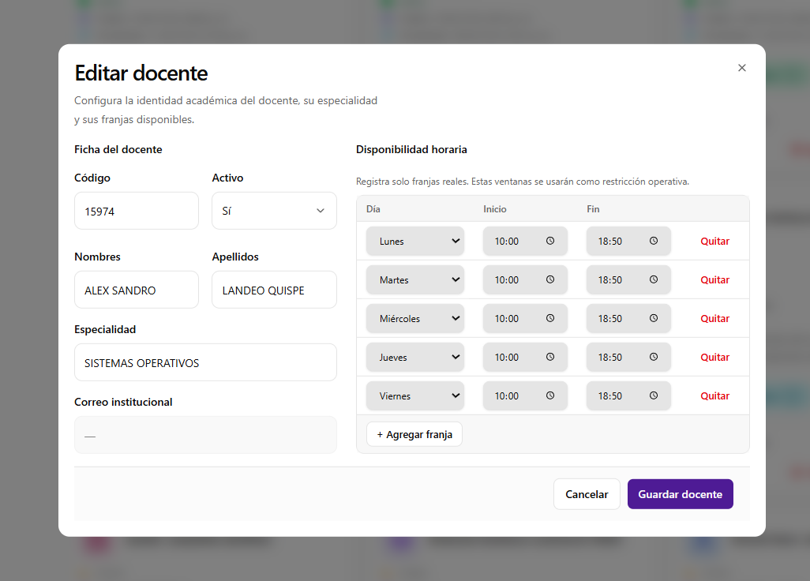

*Figura 7.5: Formulario de edición de datos del docente.*

**Pasos:**

1. Clic en **Editar**.
2. Modifique los campos permitidos.
3. Guarde.

---

### 7.6 Desactivar un docente

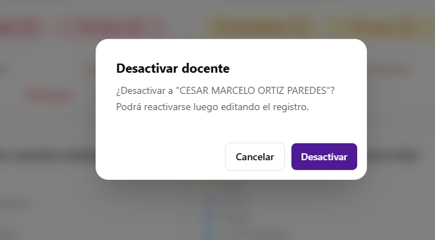

*Figura 7.6: Confirmación para desactivar docente.*

**Pasos:**

1. Clic en **Desactivar**.
2. Confirme en el diálogo.

---

## 8. Gestión de aulas

**Ruta:** `/admin/classrooms` · **Rol:** Administrador

---

### 8.1 Pantalla principal — listado de aulas

Pantalla donde se observan todas las aulas y sus características.

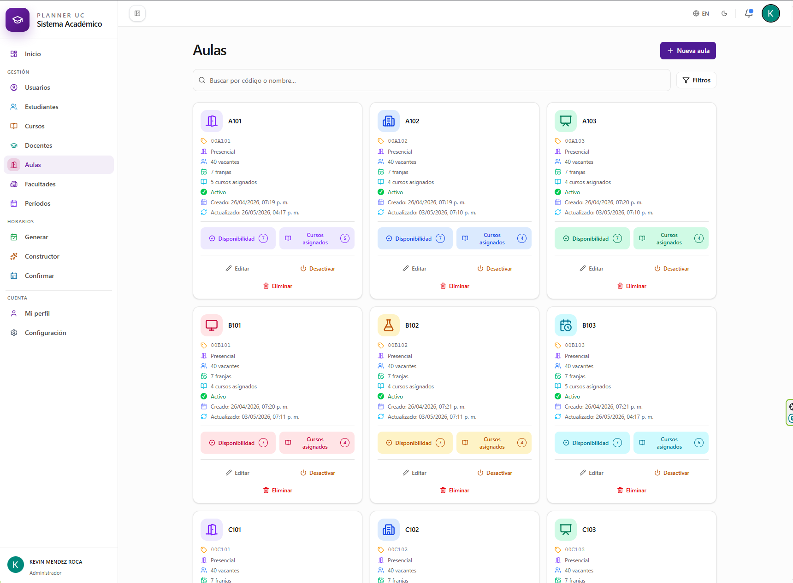

*Figura 8.1: Listado general de aulas.*

**Pasos:**

1. Menú lateral → **Aulas**.
2. Revise código, tipo, capacidad y estado.

---

### 8.2 Crear una nueva aula

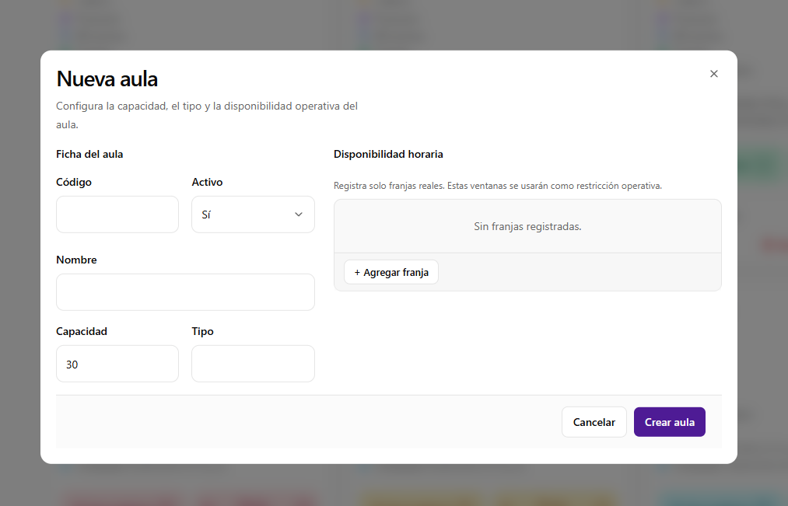

*Figura 8.2: Formulario de registro de aula.*

**Pasos:**

1. Clic en **Nueva aula**.
2. Complete código, nombre, tipo, capacidad y estado.
3. Clic en **Crear aula**.

---

### 8.3 Editar disponibilidad del aula

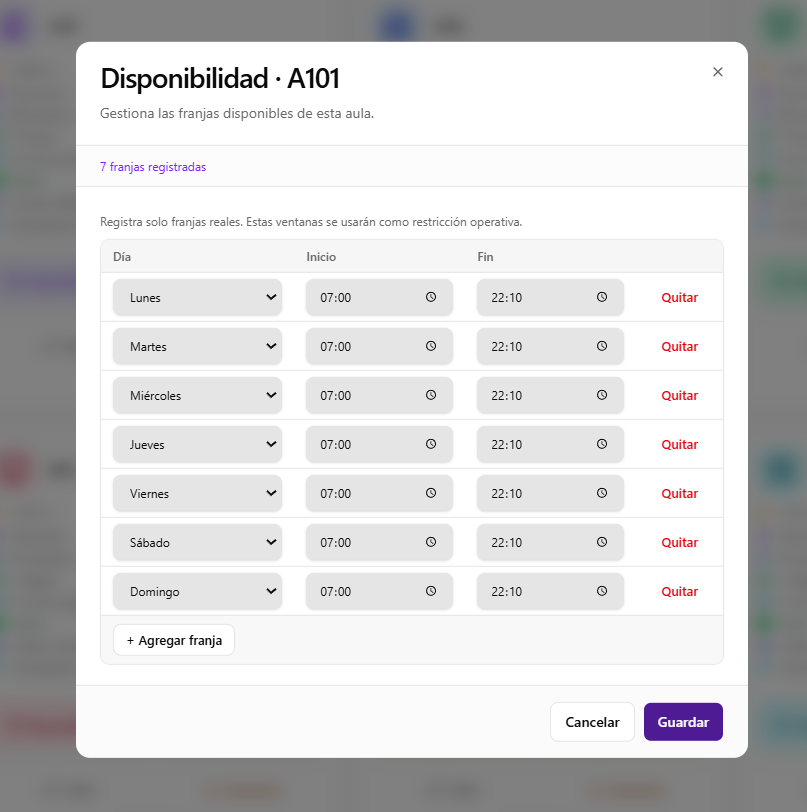

*Figura 8.3: Grilla de disponibilidad horaria del aula.*

**Pasos:**

1. Clic en **Disponibilidad**.
2. Marque franjas disponibles o bloqueadas.
3. Guarde.

---

### 8.4 Asignar cursos compatibles al aula

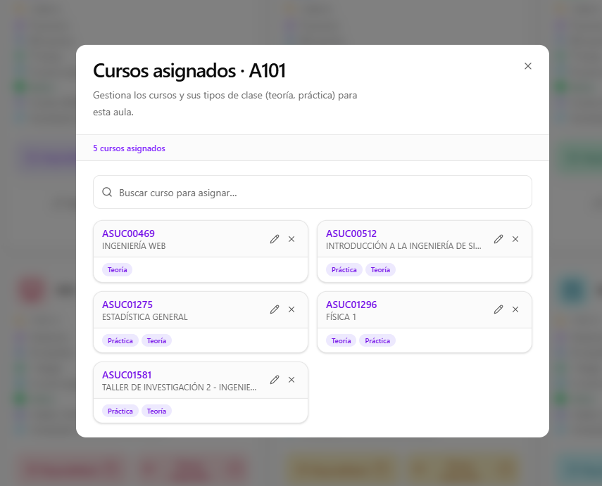

*Figura 8.4: Cursos compatibles con el tipo de aula.*

**Pasos:**

1. Clic en **Cursos asignados**.
2. Relacione cursos que pueden usar el espacio.
3. Guarde.

---

### 8.5 Editar aula

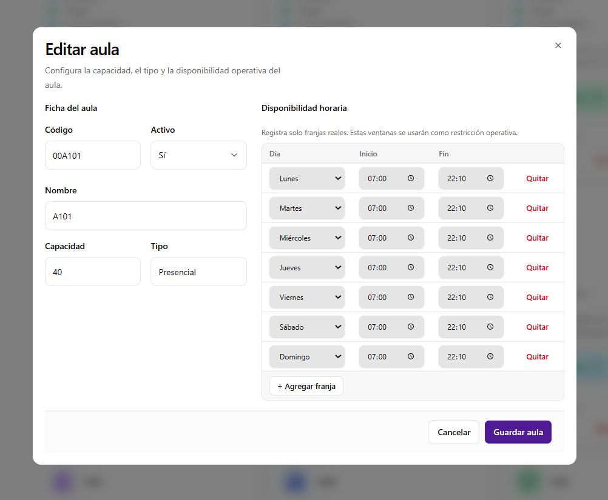

*Figura 8.5: Formulario de edición de aula.*

**Pasos:**

1. Clic en **Editar**.
2. Modifique datos.
3. Guarde.

---

### 8.6 Activar y desactivar aula

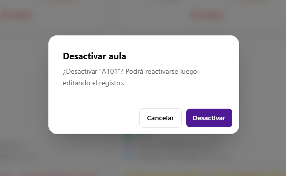

*Figura 8.6: Confirmación para activar o desactivar aula.*

**Pasos:**

1. Clic en **Desactivar** o **Activar**.
2. Confirme en el diálogo.

---

## 9. Gestión de facultades y carreras

**Ruta:** `/admin/facultades` · **Rol:** Administrador

---

### 9.1 Pantalla principal — listado de facultades

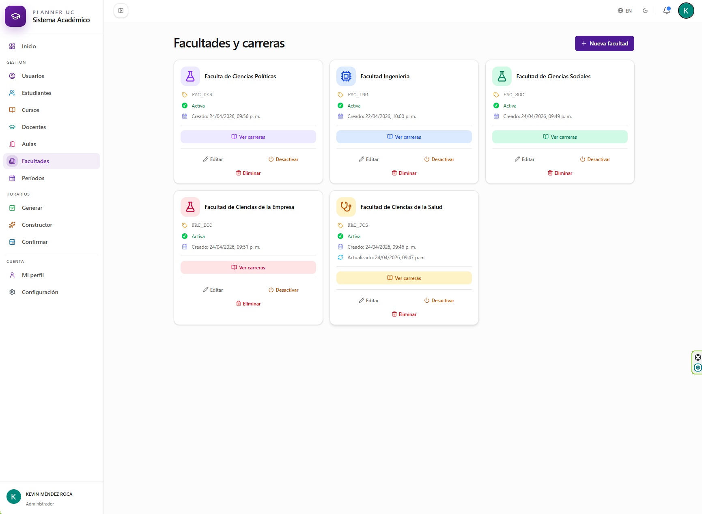

*Figura 9.1: Pantalla de facultades con sus características.*

**Pasos:**

1. Menú lateral → **Facultades**.
2. Revise nombre, código y carreras asociadas.

---

### 9.2 Crear una nueva facultad

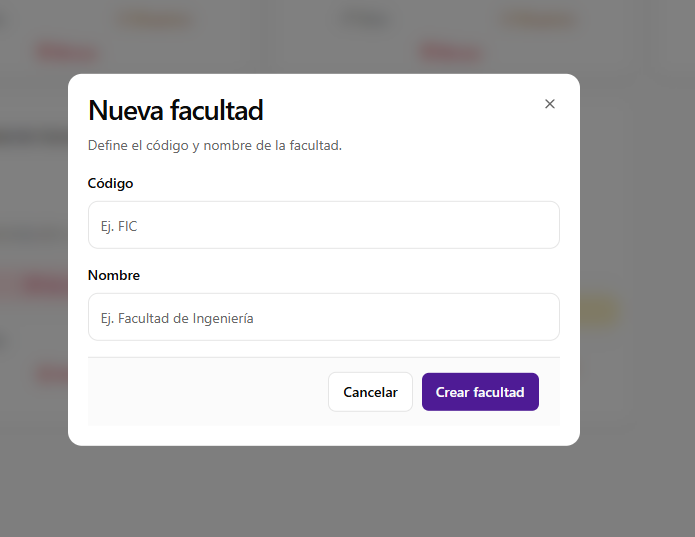

*Figura 9.2: Formulario para agregar facultad.*

**Pasos:**

1. Clic en **Nueva facultad**.
2. Ingrese código, nombre y estado.
3. Clic en **Crear**.

---

### 9.3 Agregar carrera a una facultad

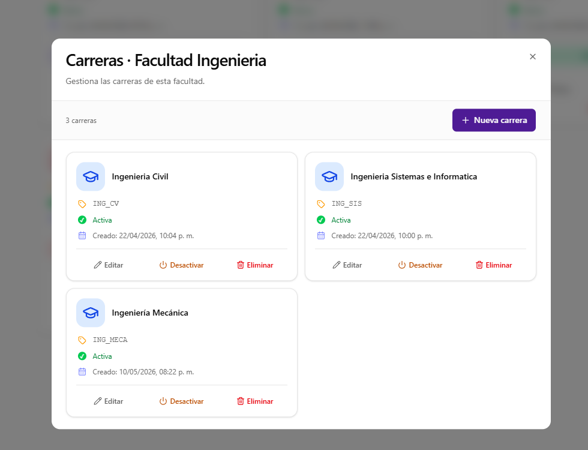

*Figura 9.3: Formulario para agregar carrera a la facultad seleccionada.*

**Pasos:**

1. En la facultad → **Agregar carrera**.
2. Complete código y nombre.
3. Guarde.

---

### 9.4 Editar facultad

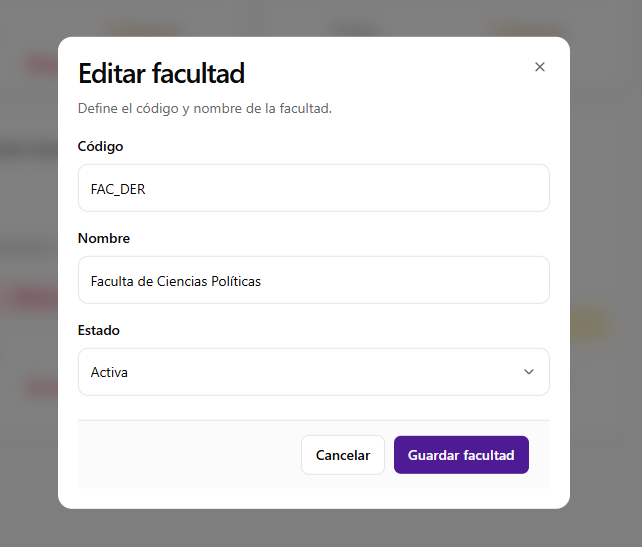

*Figura 9.4: Formulario de edición de facultad.*

**Pasos:**

1. Clic en **Editar**.
2. Modifique datos.
3. Guarde.

---

### 9.5 Activar y desactivar facultad

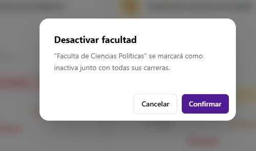

*Figura 9.5: Confirmación para activar o desactivar facultad.*

**Pasos:**

1. Clic en **Desactivar** o **Activar**.
2. Confirme.

---

## 10. Gestión de períodos académicos

**Ruta:** `/admin/academic-periods` · **Rol:** Administrador

---

### 10.1 Pantalla principal — listado de períodos

Pantalla para visualizar, buscar y filtrar períodos académicos.

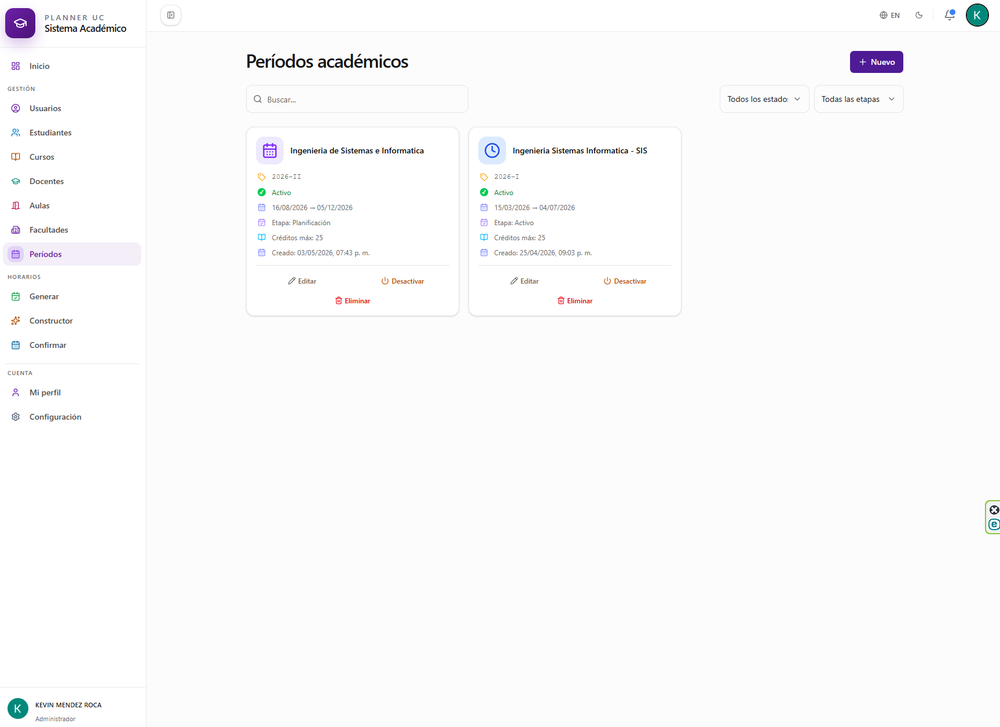

*Figura 10.1: Listado de períodos académicos.*

**Pasos:**

1. Menú lateral → **Períodos**.
2. Busque por código o nombre.
3. Verifique fechas y estado activo.

---

### 10.2 Crear un período académico

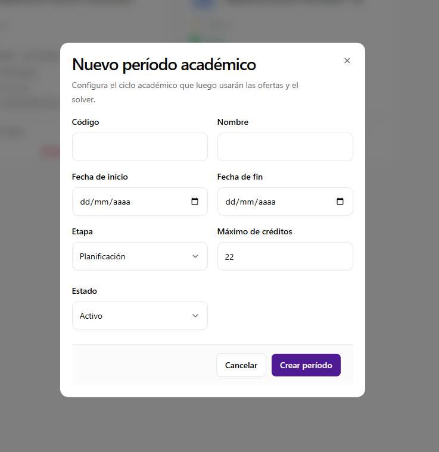

*Figura 10.2: Formulario para crear período académico.*

**Pasos:**

1. Clic en **Nuevo período**.
2. Complete código, nombre, fechas y estado.
3. Clic en **Crear período**.

---

### 10.3 Editar período académico

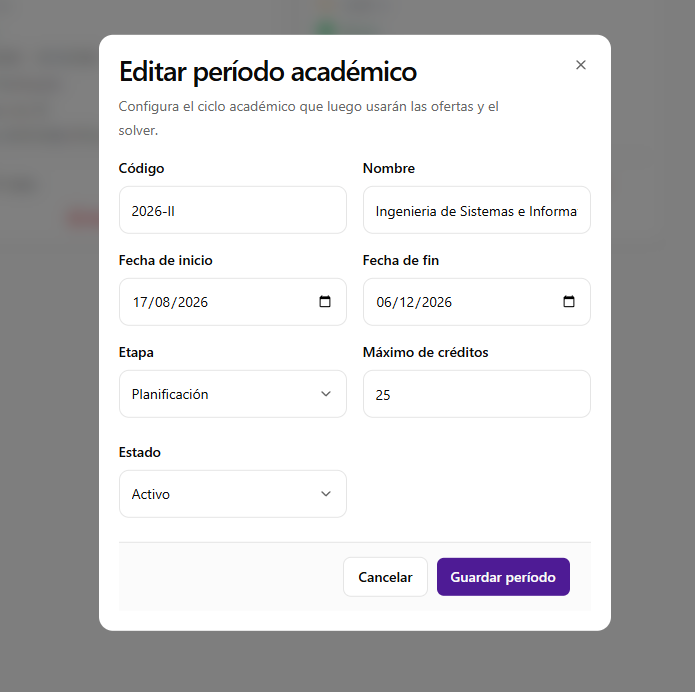

*Figura 10.3: Formulario de edición de período.*

**Pasos:**

1. Clic en **Editar**.
2. Ajuste fechas o nombre.
3. Guarde.

---

### 10.4 Activar y desactivar período

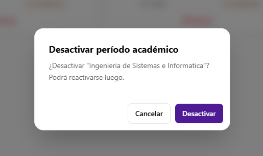

*Figura 10.4: Confirmación para activar o desactivar período.*

**Pasos:**

1. Clic en **Desactivar** o **Activar**.
2. Confirme.

---

## 11. Generación de horarios (coordinador / administrador)

**Ruta:** `/coordinator/schedule/generate` · **Roles:** Coordinador, Administrador

Flujo en **4 pasos** con el solver CSP.

---

### 11.1 Paso 1 — Seleccionar período y carrera

En esta pantalla seleccione el período académico, la carrera y el tiempo del solver. Luego clic en **Continuar**.

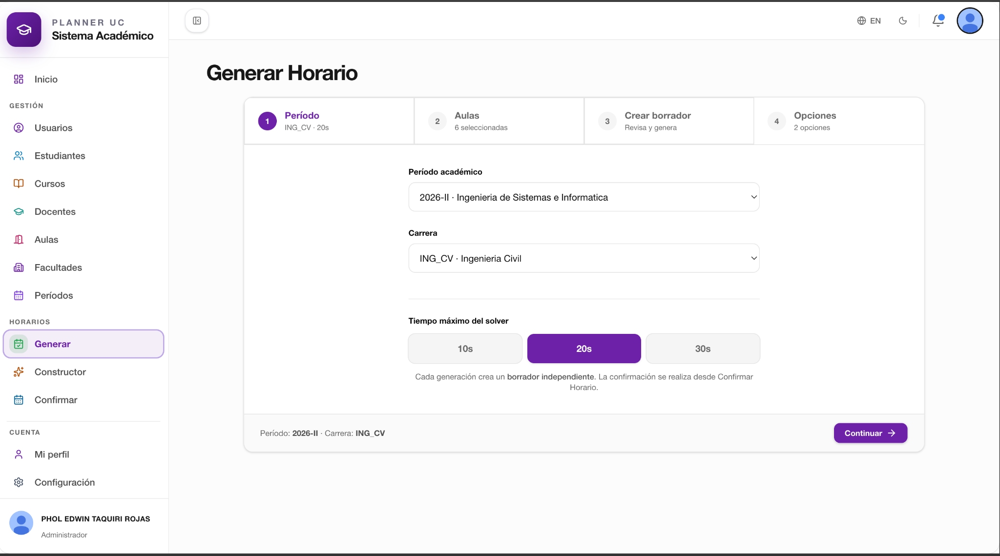

*Figura 11.1: Selección de período académico, carrera y tiempo límite.*

**Pasos:**

1. Menú → **Horarios → Generar**.
2. Paso 1: seleccione **período** y **carrera**.
3. (Opcional) Ajuste tiempo límite del solver.
4. Clic en **Continuar**.

---

### 11.2 Paso 2 — Seleccionar aulas

Seleccione las aulas que participarán en la generación. Clic en **Continuar**.

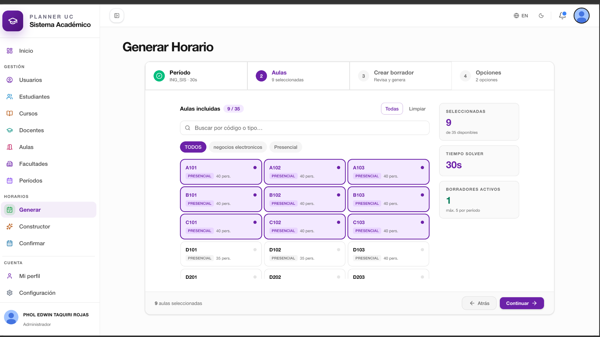

*Figura 11.2: Selección de aulas disponibles.*

**Pasos:**

1. Marque las aulas con checkbox.
2. Use búsqueda y filtro por tipo.
3. Clic en **Continuar**.

---

### 11.3 Paso 3 — Resumen y crear borrador

Pantalla de resumen de lo seleccionado. Clic en **Crear borrador** y luego en **Ver opciones**.

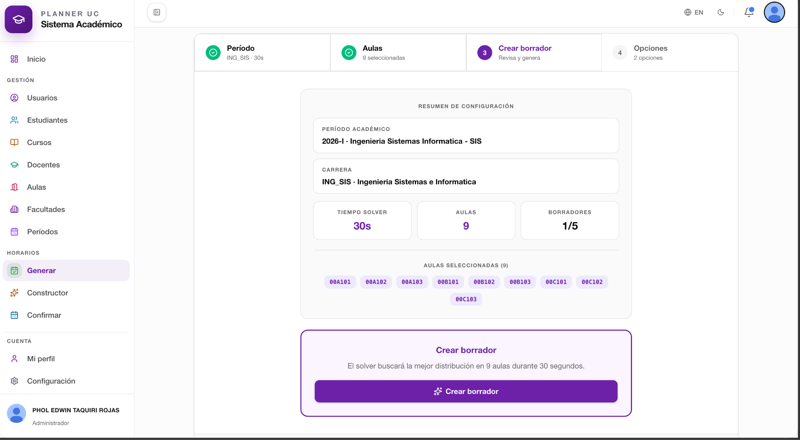

*Figura 11.3: Paso 3 del asistente — resumen de configuración antes de generar.*

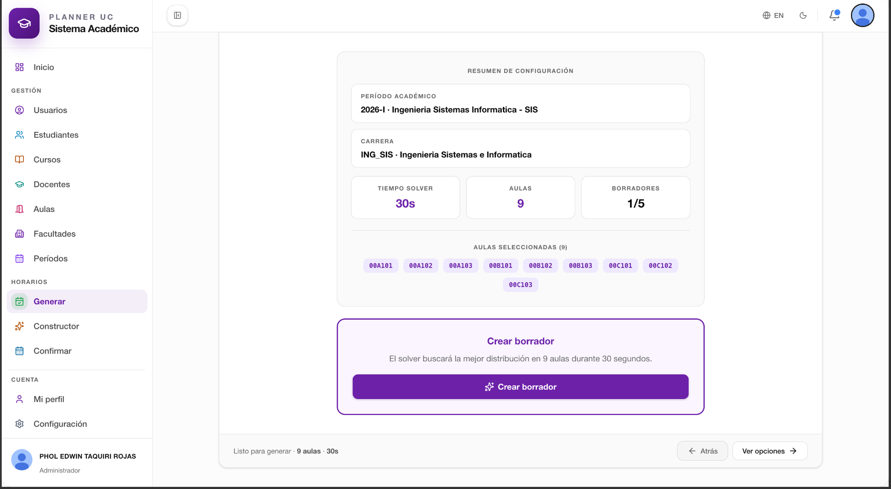

*Figura 11.4: Detalle del resumen con aulas seleccionadas y botón Crear borrador.*

**Pasos:**

1. Revise período, carrera, tiempo del solver y aulas (capturas 11.3 y 11.4).
2. Clic en **Crear borrador**.
3. Espere el procesamiento del solver.
4. Clic en **Ver opciones**.

---

### 11.4 Paso 4 — Comparar opciones de horario

Se listan las opciones generadas. Puede **Ver detalles**, **Modificar aulas**, **Generar borrador** o **Volver a configuración**.

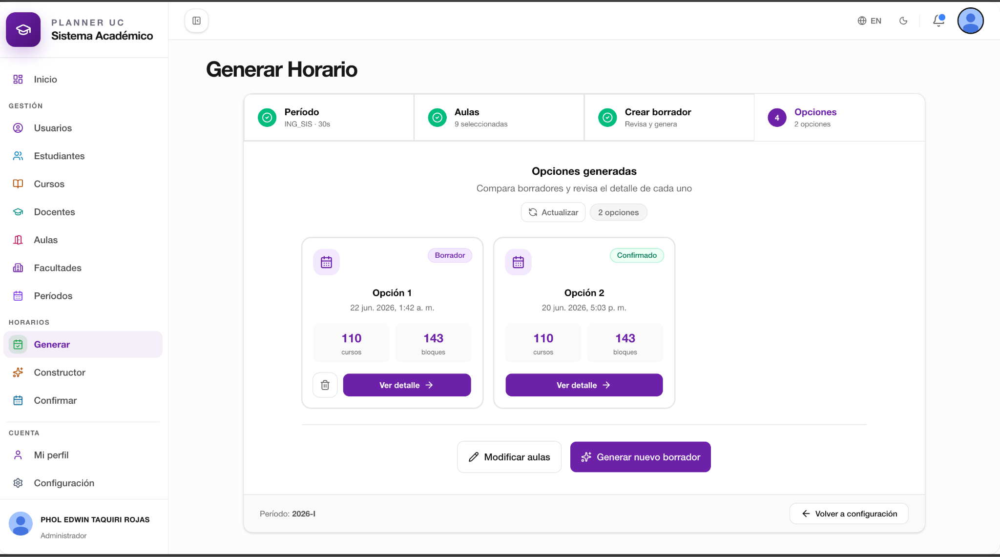

*Figura 11.5: Listado de opciones de horario generadas.*

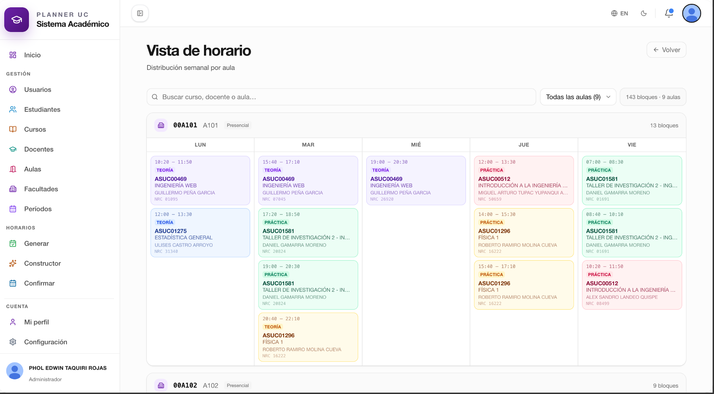

*Figura 11.6: Vista de detalle — distribución semanal por aula (Ver detalle).*

**Pasos:**

1. Revise cada opción en el listado (Figura 11.5).
2. **Ver detalle** → abre la vista semanal por aula (Figura 11.6).
3. **Modificar aulas** → regresa a cambiar las aulas seleccionadas.
4. **Volver a configuración** → regresa al paso 3.
5. Elija la opción para Constructor o Confirmar.

---

## 12. Constructor y confirmación de horarios docentes

**Ruta:** `/coordinator/schedule/builder` y `/coordinator/schedule/confirm`

> *Este flujo no incluye capturas en el documento original; se describe el procedimiento.*

### 12.1 Constructor manual

1. Seleccione un borrador existente.
2. Visualice la grilla semanal.
3. **Agregar curso** → elija curso, docente, aula y franja.
4. Mueva o elimine sesiones según necesite.
5. Guarde cambios.

### 12.2 Confirmar horario

1. Vaya a **Confirmar horario**.
2. Seleccione el borrador definitivo.
3. Verifique que no haya conflictos.
4. Clic en **Confirmar horario**.

---

## 13. Vista estudiante — consulta y generación de horario

**Rol:** Estudiante

---

### 13.1 Pantalla de inicio del estudiante

Panel principal con accesos rápidos a Mi horario, Ver horarios y Armar horario.

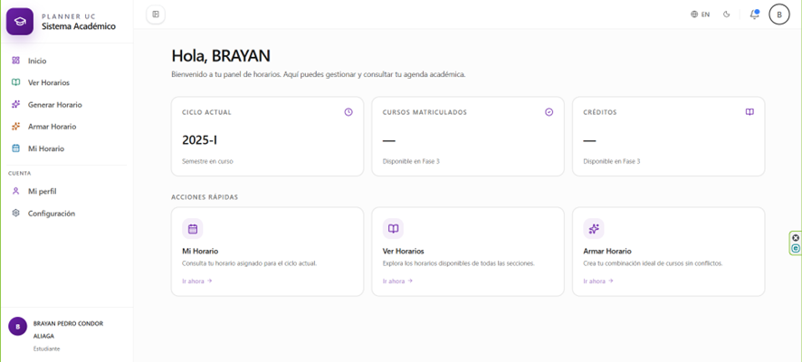

*Figura 13.1: Pantalla de inicio con resumen del ciclo y accesos rápidos.*

**Pasos:**

1. Tras login → **Inicio** (`/student`).
2. Revise ciclo actual y tarjetas informativas.
3. Use los accesos rápidos según lo que necesite hacer.

---

### 13.2 Consultar oferta horaria (Ver horarios)

Explora los horarios disponibles por curso y sección del período.

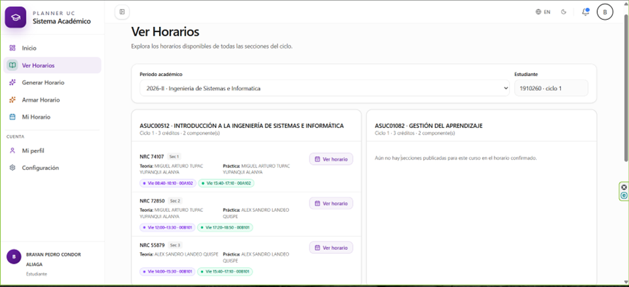

*Figura 13.2: Listado de cursos con secciones (NRC), docentes y franjas horarias.*

**Pasos:**

1. Menú → **Ver horarios** (`/student/schedule/generate`).
2. Seleccione **período académico**.
3. Revise cada curso pendiente y sus secciones publicadas.
4. Clic en **Ver horario** en una sección para ver el detalle.

---

### 13.3 Detalle de horario de una sección

Vista semanal de un curso y sección específicos (desde Ver horarios).

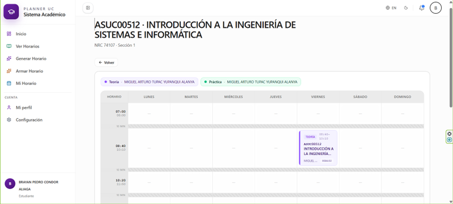

*Figura 13.3: Grilla semanal de un curso (teoría/práctica, docente y aula).*

**Pasos:**

1. Desde **Ver horarios**, clic en **Ver horario** de la sección deseada.
2. Revise teoría y práctica en la grilla.
3. Clic en **Volver** para regresar al listado.

---

### 13.4 Generar opciones de horario — formulario inicial

Seleccione carrera y período para iniciar la generación automática.

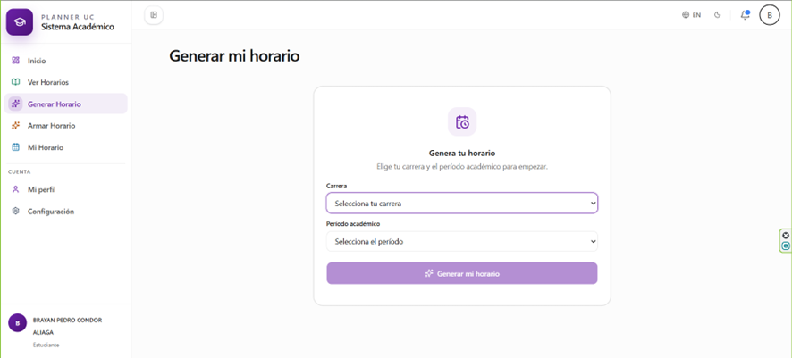

*Figura 13.4: Selección de carrera y período académico.*

**Pasos:**

1. Menú → **Generar horario** (`/student/schedule/options`).
2. Elija **Carrera** y **Período académico**.
3. Clic en **Generar mi horario** o **Generar opción**.

---

### 13.5 Opciones generadas

Lista de alternativas creadas por el solver con contador de reserva.

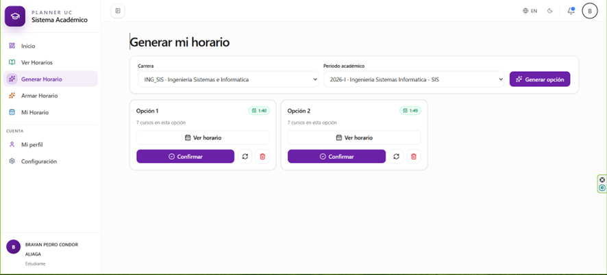

*Figura 13.5: Opciones 1 y 2 con acciones Ver horario, Confirmar y Eliminar.*

**Pasos:**

1. Tras generar, revise las tarjetas **Opción 1**, **Opción 2**, etc.
2. Observe el **contador de reserva** (hold de cupo, ~2 min).
3. Use **Renovar** si necesita más tiempo.
4. Clic en **Ver horario** para revisar una opción antes de confirmar.

---

### 13.6 Detalle de una opción (grilla semanal)

Horario completo de la opción seleccionada.

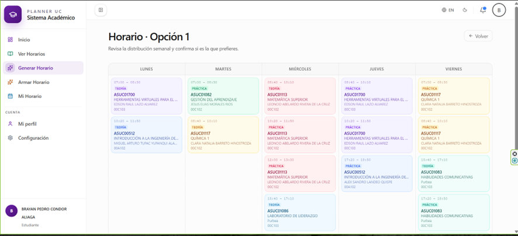

*Figura 13.6: Distribución semanal de la Opción 1 con todos los cursos.*

**Pasos:**

1. Clic en **Ver horario** en la opción deseada.
2. Revise solapamientos, créditos y distribución por día.
3. **Confirmar** si es la opción definitiva, o regrese y genere otra.

---

## 14. Constructor manual de horario del estudiante

**Ruta:** `/student/schedule/builder` · **Rol:** Estudiante

Arme el horario curso por curso con validación en tiempo real.

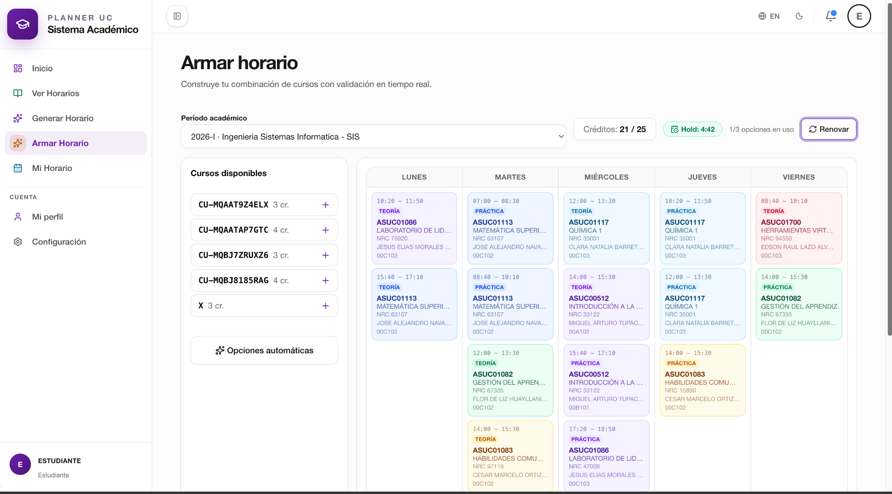

*Figura 14.1: Constructor con cursos disponibles, grilla semanal y contador de créditos.*

### 14.1 Iniciar borrador

1. Menú → **Armar horario**.
2. Seleccione **período académico**.
3. El sistema crea o recupera un borrador.
4. Opcional: importar desde una opción generada.

### 14.2 Agregar cursos

1. En **Cursos disponibles**, clic en **+** junto al curso.
2. Elija sección compatible.
3. El sistema valida prerrequisitos, cupos y conflictos.
4. Repita hasta completar la carga (observe **Créditos**).

### 14.3 Confirmar horario

1. Observe el contador **Hold** y renueve si hace falta.
2. Clic en **Confirmar horario**.
3. Confirme en el diálogo.

---

## 15. Mi perfil y cuenta

**Ruta:** `/profile` · **Rol:** Todos

Consulta y edición de datos personales y académicos.

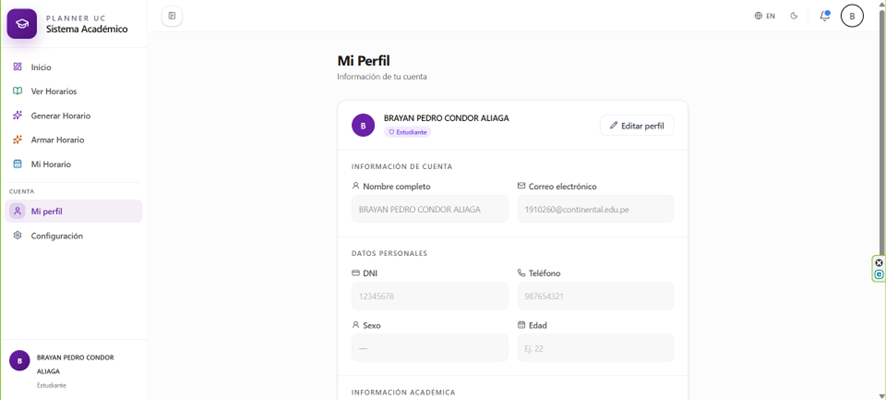

*Figura 15.1: Pantalla Mi perfil con datos de cuenta, personales y académicos.*

**Pasos:**

1. Menú lateral → **Mi perfil** (sección Cuenta).
2. Revise nombre, correo, DNI y datos académicos.
3. Clic en **Editar perfil** para modificar campos permitidos.

---

## 16. Mi horario confirmado

**Ruta:** `/student/my-schedule` · **Rol:** Estudiante

1. Menú → **Mi horario**.
2. Seleccione el período si aplica.
3. Consulte la grilla semanal definitiva del ciclo activo.

---

## 17. Solución de problemas frecuentes

| Problema | Qué hacer |
|:---|:---|
| No puedo iniciar sesión | Verifique credenciales; contacte al administrador |
| Correo Google no permitido | Use `@continental.edu.pe` |
| No aparecen cursos pendientes | Revise cursos aprobados con administración |
| El solver no genera horario | Complete disponibilidades y datos del catálogo |
| Conflicto al agregar curso | Elija otra sección u horario |
| Expiró la reserva | Renueve o regenere la opción |

---

## Apéndice — Referencia de rutas

| Módulo | Ruta |
|:---|:---|
| Login | `/login` |
| Usuarios | `/admin/users` |
| Estudiantes | `/admin/students` |
| Cursos | `/admin/courses` |
| Docentes | `/admin/teachers` |
| Aulas | `/admin/classrooms` |
| Facultades | `/admin/facultades` |
| Períodos | `/admin/academic-periods` |
| Generar horario | `/coordinator/schedule/generate` |
| Opciones estudiante | `/student/schedule/options` |
| Constructor estudiante | `/student/schedule/builder` |
| Mi horario | `/student/my-schedule` |

---

*Manual convertido desde «Manual del Software.docx». Capturas reextraídas en orden del documento original en [`Capturas/`](Capturas/).*
