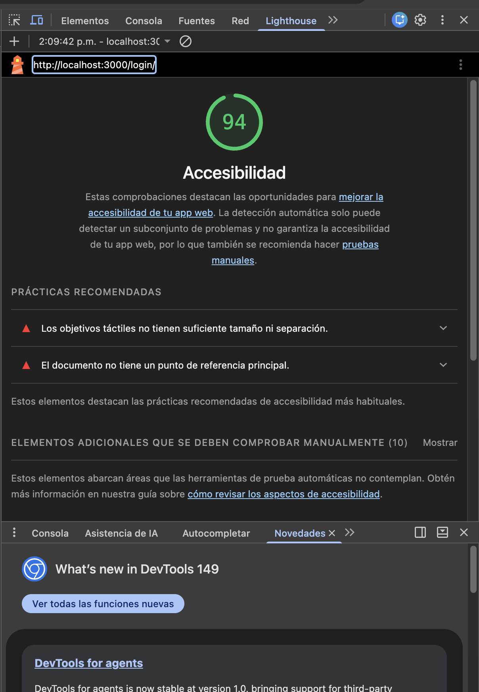
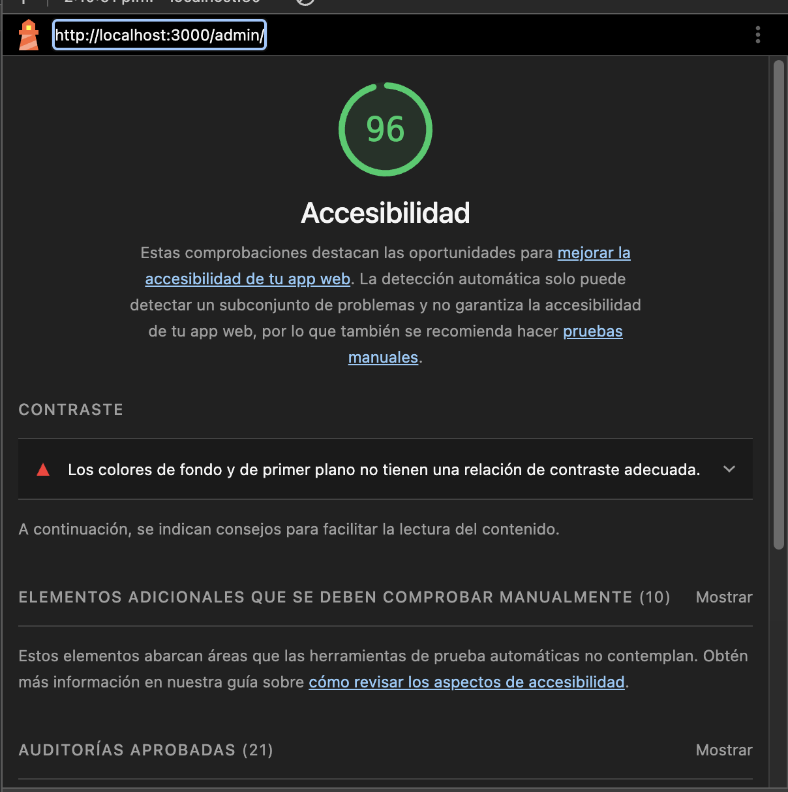
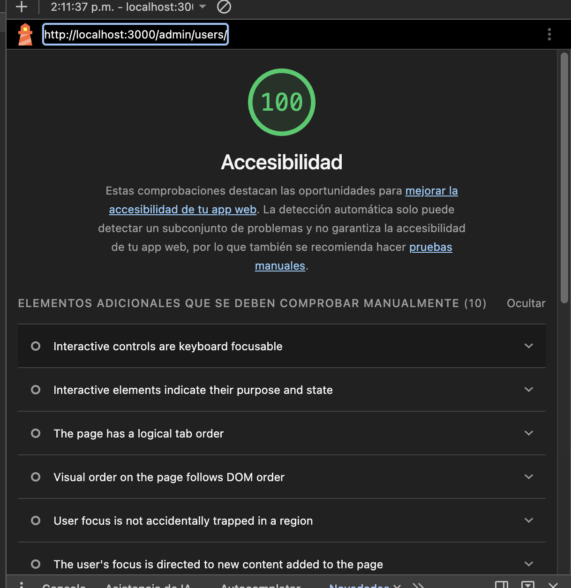
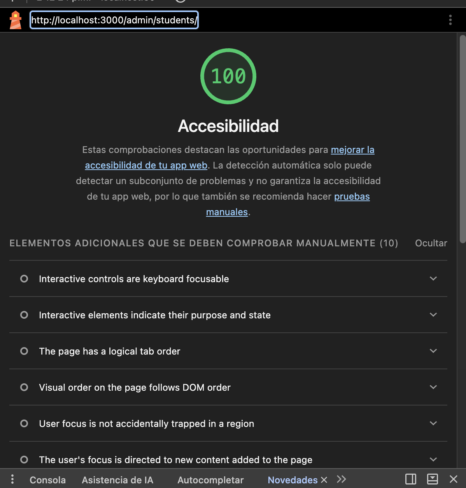
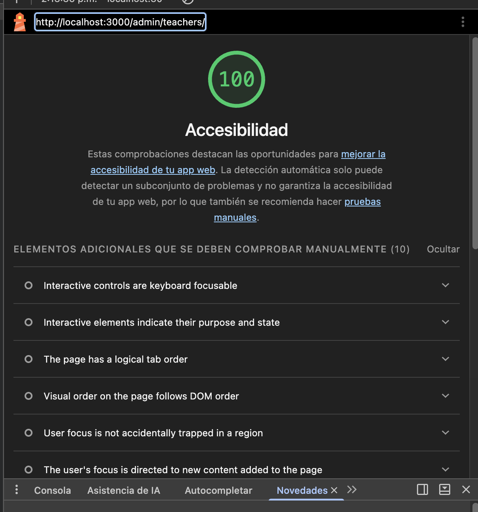
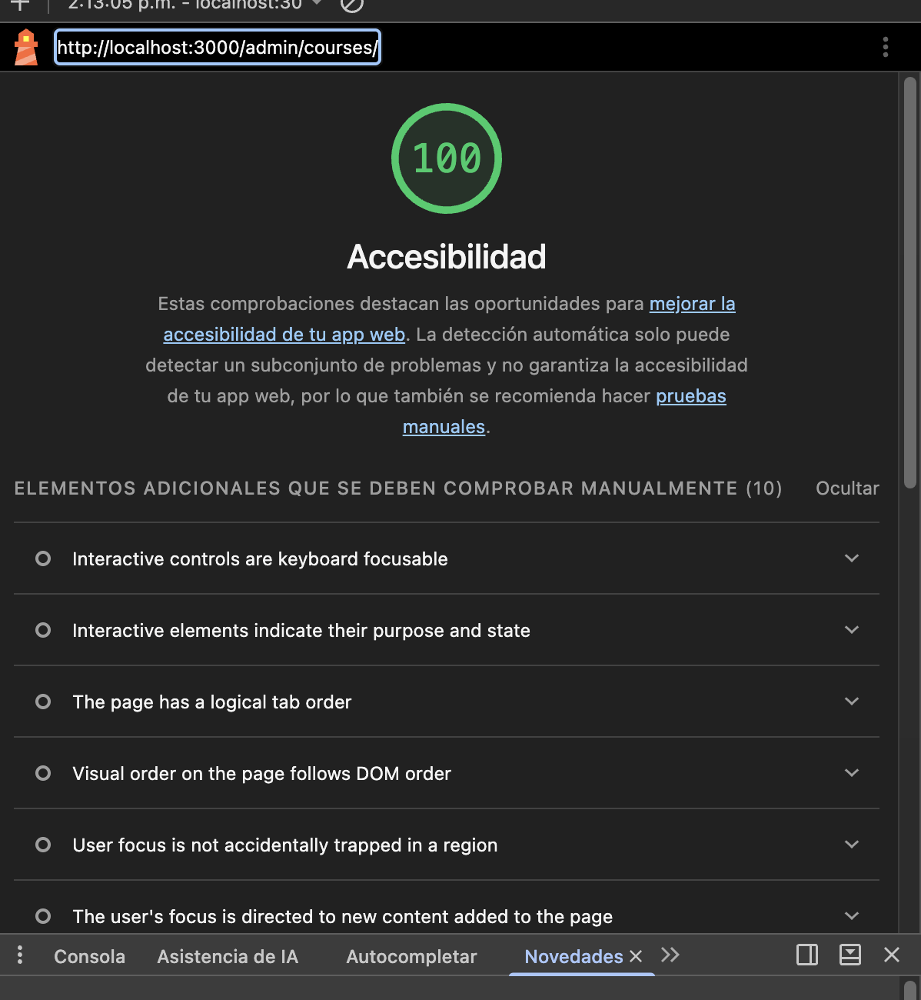
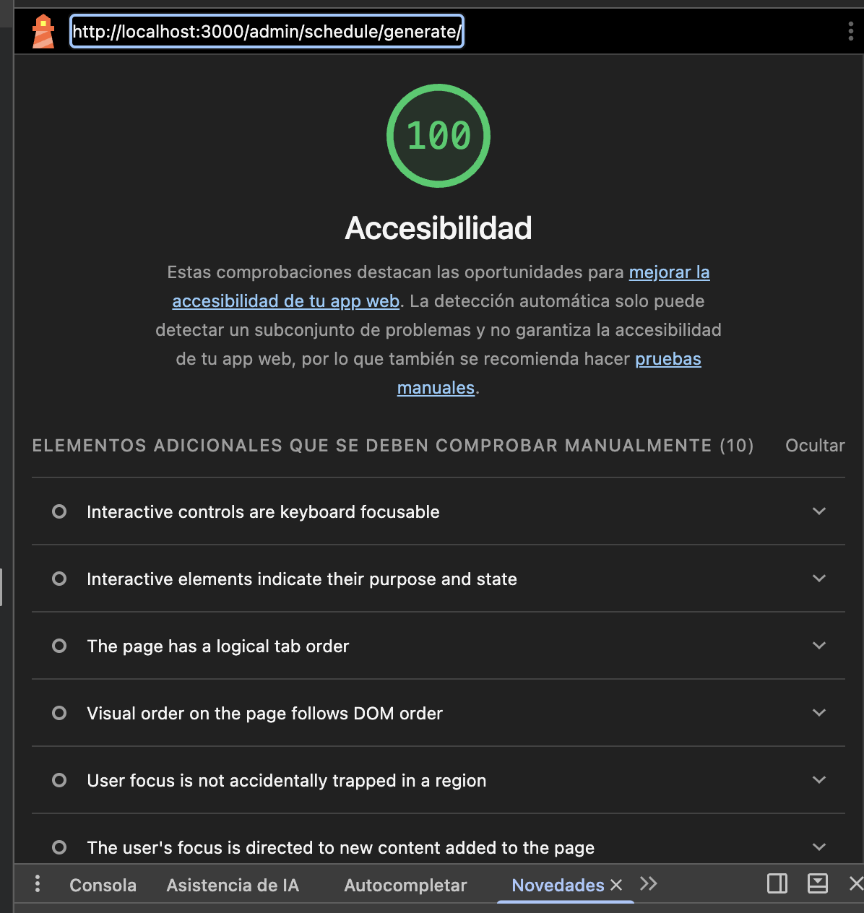
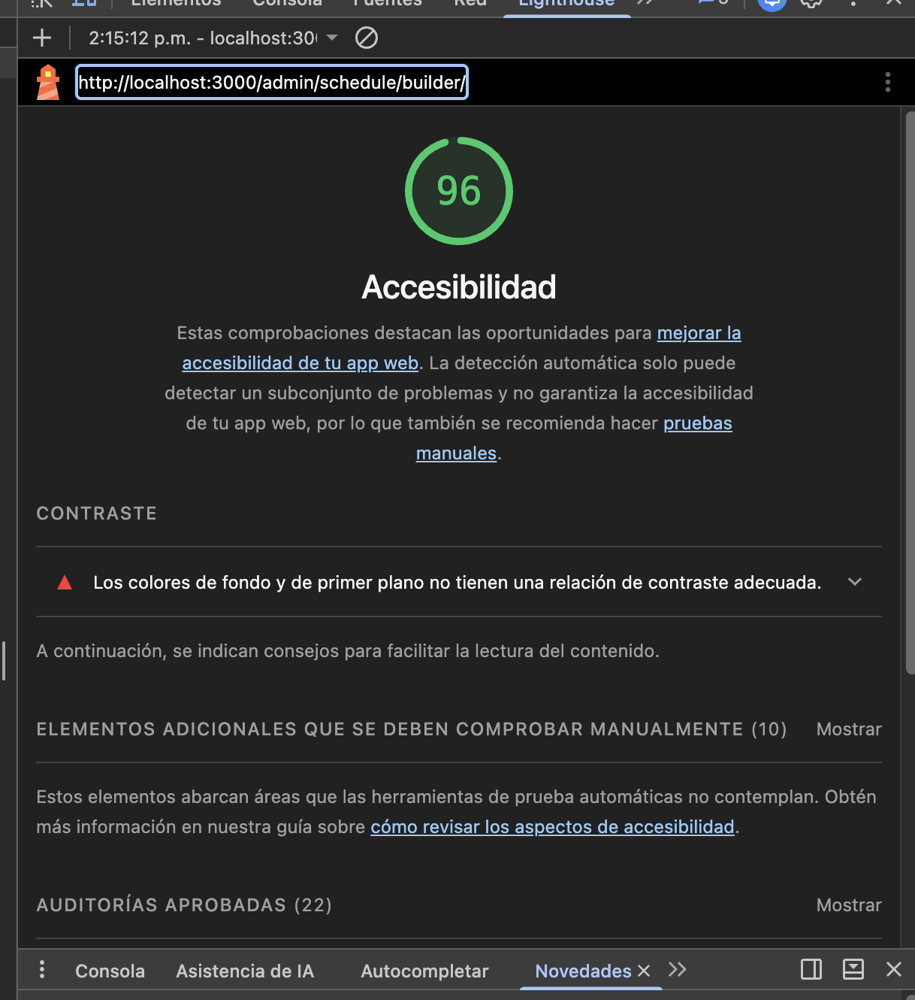
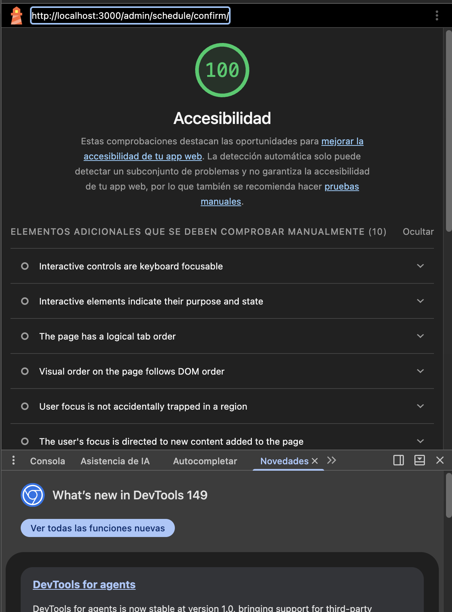

# Anexo C - Evaluación de Accesibilidad WCAG

## C.1 Alcance

Se evaluó el frontend de Planner UC conforme a los criterios WCAG 2.0/2.1 nivel A/AA. La evaluación combina:
- Inspección del DOM y componentes React.
- Revisión de uso de etiquetas semánticas y atributos ARIA.
- Validación de contraste y navegación por teclado.
- Uso de componentes accesibles (shadcn/ui + Radix UI).
- **Escaneo automatizado con axe-core + Playwright** (`frontend/tests/e2e/accessibility/a11y.spec.ts`, `pnpm test:a11y`): 35 rutas reales (públicas + 4 roles: student, coordinator, teacher, admin), con login real por rol, ejecutado contra producción (https://horariosu.wankoraep.com) y reverificado tras las correcciones contra el entorno reconstruido localmente con los mismos usuarios.

**Herramientas usadas:**
- ✅ axe-core + Playwright (automatizado, implementado y ejecutado — ver C.3)
- ✅ Lighthouse Accessibility Audit (ejecutado post-correcciones sobre 9 rutas — ver C.3.1)
- WAVE (WebAIM) (pendiente, recomendado como complemento)
- Inspección manual del DOM

## C.2 Checklist WCAG 2.0 / 2.1

*Resultados reales del escaneo automatizado axe-core (35 rutas × roles); reemplaza una versión anterior basada en estimación.*

| Criterio | Nivel | Descripción | Estado | Evidencia / Observación |
|---|---|---|---|---|
| 1.1.1 Non-text Content | A | Textos alternativos en imágenes | ✅ Cumple | 0 violaciones `image-alt` en las 35 rutas escaneadas con axe-core |
| 1.3.1 Info and Relationships | A | Estructura semántica correcta | ✅ Cumple | Uso de `Dialog`, `Form`, `Button`, `Label` de shadcn/ui |
| 1.4.3 Contrast (Minimum) | AA | Contraste ≥ 4.5:1 para texto | 🔄 En progreso | Escaneo inicial: 34/35 rutas con `color-contrast`. Corregidos los tokens de color raíz (ver C.3); reescaneo: 6/35 rutas con 1 hallazgo residual pendiente |
| 1.4.11 Non-text Contrast | AA | Contraste en componentes interactivos | ⚠️ Parcial | No cubierto por el ruleset por defecto de axe-core en este pase; pendiente revisión manual de bordes/focus |
| 2.1.1 Keyboard | A | Navegación completa por teclado | ⚠️ Parcial | No cubierto por axe-core (requiere interacción); revisar manualmente tablas/grillas complejas |
| 2.4.3 Focus Order | A | Orden de foco lógico | ✅ Cumple | Radix UI maneja focus trap en modales |
| 2.4.4 Link Purpose (In Context) | A | Propósito de enlaces claro | ✅ Cumple | Enlaces con texto descriptivo |
| 2.5.3 Label in Name | A | Etiqueta visible incluida en nombre accesible | ✅ Cumple | `Label` asociado a inputs mediante `htmlFor` |
| 3.3.1 Error Identification | A | Errores identificados claramente | ✅ Cumple | Zod + React Hook Form muestran mensajes por campo |
| 3.3.2 Labels or Instructions | A | Campos con etiquetas/instrucciones | ✅ Cumple (corregido) | Escaneo inicial encontró campos en `/profile` con `<label>` visible pero sin asociación (`label` rule, CRITICAL); corregidos 8 controles con `htmlFor`/`id` |
| 4.1.2 Name, Role, Value | A | Atributos ARIA correctos | ✅ Cumple (corregido) | Escaneo inicial encontró 10 `<select>` sin nombre accesible (`select-name`) y 2 switches de notificaciones sin nombre (`button-name`), ambos CRITICAL; corregidos con `aria-label` |

## C.3 Hallazgos y evidencias (escaneo automatizado axe-core)

### Metodología

Se ejecutó `frontend/tests/e2e/accessibility/a11y.spec.ts` (axe-core + Playwright, reglas WCAG 2.0/2.1 A/AA) contra **35 rutas**: 2 públicas (`/login`, `/forgot-password`) y las rutas reales de cada rol según `components/layout/Sidebar.tsx` — student (7), coordinator (8), teacher (3), admin (15) —, con login real por rol (una sesión por rol, reutilizada para todas sus rutas).

**Resultado inicial (producción, https://horariosu.wankoraep.com):** 1/35 rutas sin violaciones, 34/35 con al menos una violación.

### Hallazgo 1: Contraste de color insuficiente — presente en 34/35 rutas (1.4.3) — Corregido en su mayoría

**Causas raíz identificadas (3, todas en tokens de diseño compartidos):**

1. `app/globals.css`: `--color-gray-400: #808080` (usado vía `text-gray-400`) — contraste 3.2–3.9:1 contra los fondos donde se usa (necesita ≥4.5:1).
2. `app/globals.css`: `--muted-foreground: oklch(0.556 0 0)` (≈ `#737373`, usado vía `text-muted-foreground`) — pasa contra blanco puro pero falla contra fondos `muted`/`card` (3.9–4.5:1).
3. Insignias de color en páginas CRUD de admin (`students`, `teachers`, `classrooms`, `courses`, `facultades`, `academic-periods`) y constructor de horarios: el patrón `bg-{color}-100` + `text-{color}-600` de Tailwind v4 (amber, orange, emerald, cyan, blue, pink, rose) da 2.9–4.3:1, no 4.5:1. También la etiqueta de estado "Activo" (`text-green-500`, 2.2:1).

**Mitigación implementada:**
- `--color-gray-400` → `#686868` y `--muted-foreground` → `#686868` (verificado con los fondos reales medidos por axe: ≥4.55:1 en todos los casos).
- `text-{color}-600` → `text-{color}-700` (u `-800` para green) en 14 archivos (`app/(app)/admin/{students,teachers,classrooms,courses,facultades,academic-periods}/page.tsx`, páginas de horarios y componentes del constructor), usando los valores oklch reales de `tailwindcss@4.2.2` para confirmar ≥4.5:1 antes de aplicar el cambio.
- `text-green-500` → `text-green-700` para la etiqueta "Activo" (2.2:1 → 4.94:1).

**Resultado tras la corrección (reescaneo local, mismos usuarios que producción):** 29/35 rutas sin violaciones (antes 1/35).

**Pendiente (6/35 rutas, 1 causa raíz residual):** un texto con `opacity-60` sobre una tarjeta `bg-violet-50`/`border-violet-200` (horario/tarjetas de período) da 4.3:1, muy cerca del umbral de 4.5:1. Aparece en `/student`, `/coordinator/schedule/generate`, `/coordinator/schedule/builder`, `/admin`, `/admin/academic-periods`, `/admin/schedule/builder`. Queda como ítem abierto en el plan de corrección (C.6).

### Hallazgo 2: Controles de formulario sin nombre accesible — `select-name` y `button-name` (4.1.2) — Corregido

**Observación técnica**
10 elementos `<select>` (filtros de período/horario/aula en `*/schedule/generate`, `builder`, `confirm` y `*/schedule/view`, en los 3 roles que los usan) no tenían `aria-label` ni asociación con su `<label>` visible — el `<label>` existía en el DOM pero sin `htmlFor`/`id` que lo conectara al control. Severidad CRITICAL.

Adicionalmente, los 2 switches de notificaciones en `/settings` (`role="switch"`) no tenían nombre accesible (sin texto visible ni `aria-label`). Severidad CRITICAL.

**Mitigación implementada**
- Se agregó `aria-label` descriptivo a los 10 `<select>` (ej. "Período académico", "Horario", "Filtrar por aula", "Día de la franja N").
- Se agregó la prop `label` al componente `Toggle` de `/settings`, pasada como `aria-label` al `<button role="switch">`.

### Hallazgo 3: Campos de formulario con `<label>` sin asociación — `label` (3.3.2) — Corregido

**Observación técnica**
En `/profile`, el componente compartido `FieldLabel` renderizaba un `<label>` visible (nombre completo, email, DNI, teléfono, sexo, edad, facultad, carrera) pero sin `htmlFor`, y los `<input>`/`<select>` correspondientes no tenían `id`. Axe lo reporta como severidad CRITICAL porque, aunque el texto es visible, no hay asociación programática (un lector de pantalla no anuncia la etiqueta al enfocar el campo).

**Mitigación implementada**
- `FieldLabel` ahora acepta `htmlFor`; se agregó `id` a los 6 controles correspondientes (`profile-fullname`, `profile-email`, `profile-dni`, `profile-phone`, `profile-sex`, `profile-age`, `profile-facultad`, `profile-carrera`).

### Hallazgo 4: Navegación por teclado en tablas de horarios (2.1.1) — Pendiente (no cubierto por este pase)

**Observación técnica**
Las tablas/grillas del constructor de horarios pueden requerir navegación compleja por teclado. El ruleset por defecto de axe-core no evalúa interacción real de teclado, solo estructura estática; este criterio requiere prueba manual.

**Mitigación propuesta**
1. Asegurar que celdas interactivas sean focuseables con `tabIndex`.
2. Implementar atajos de teclado documentados.
3. Probar con solo teclado.

### C.3.1 Verificación cruzada con Lighthouse (post-correcciones)

Como segunda herramienta independiente, se ejecutó Lighthouse Accessibility (Chrome DevTools) sobre 9 rutas clave, **después** de aplicar las correcciones de los Hallazgos 1-3, para confirmar el resultado de axe-core con una herramienta distinta.

| Ruta | Score | Hallazgo reportado |
|---|---|---|
| `/login` | 94 | Objetivos táctiles sin tamaño/separación suficiente; documento sin punto de referencia principal (`<main>`) |
| `/admin` (Dashboard) | 96 | Contraste de color insuficiente |
| `/admin/users` | 100 | — |
| `/admin/students` | 100 | — |
| `/admin/teachers` | 100 | — |
| `/admin/courses` | 100 | — |
| `/admin/schedule/generate` | 100 | — |
| `/admin/schedule/builder` | 96 | Contraste de color insuficiente |
| `/admin/schedule/confirm` | 100 | — |

**Promedio: 98.4 / 100.**

**Lectura de los resultados:**
- Los dos únicos hallazgos de contraste que reporta Lighthouse (`/admin` y `/admin/schedule/builder`) coinciden exactamente con el hallazgo residual ya documentado en C.3 (Hallazgo 1: tarjeta `bg-violet-50` con texto `opacity-60`, 4.3:1). **Confirma de forma independiente que es un hallazgo real**, no un falso positivo de axe-core, y que el resto de las correcciones (tokens de color, `select-name`, `label`, `button-name`) sí resolvieron el problema en las demás rutas — de ahí que 7 de 9 rutas escaneadas lleguen a 100.
- Lighthouse encontró 2 hallazgos **nuevos**, no cubiertos por el escaneo axe-core (porque se limitó a las reglas WCAG 2.0/2.1, y el tamaño de objetivos táctiles es un criterio de WCAG 2.2):
  1. **Tamaño de objetivos táctiles** (WCAG 2.2 — 2.5.8 Target Size) en `/login`.
  2. **Falta de punto de referencia `<main>`** en `/login` — la página vive en `app/(auth)/login/page.tsx`, fuera del layout `app/(app)/layout.tsx` (que sí define `<main>`); el grupo de rutas `(auth)` no tiene su propio landmark.
- Estos 2 hallazgos quedan registrados como pendientes en C.6 (ítems 11 y 12); no se corrigieron en esta pasada para no introducir un cambio de estructura JSX sin verificar cuidadosamente el anidamiento de etiquetas.

### Evidencia visual (Lighthouse)


*Figura C.1: `/login` — 94/100. Objetivos táctiles y landmark `<main>` pendientes.*


*Figura C.2: `/admin` — 96/100. Contraste residual (tarjeta `bg-violet-50`), coincide con el hallazgo de axe-core.*


*Figura C.3: `/admin/users` — 100/100.*


*Figura C.4: `/admin/students` — 100/100.*


*Figura C.5: `/admin/teachers` — 100/100.*


*Figura C.6: `/admin/courses` — 100/100.*


*Figura C.7: `/admin/schedule/generate` — 100/100.*


*Figura C.8: `/admin/schedule/builder` — 96/100. Mismo contraste residual que `/admin`.*


*Figura C.9: `/admin/schedule/confirm` — 100/100.*

## C.4 Herramientas y comandos de validación

### Lighthouse (Chrome DevTools) — ejecutado

Ejecutado post-correcciones sobre 9 rutas de `/admin/**` y `/login` (resultados y capturas en C.3.1).

1. Abrir http://localhost:3000
2. DevTools → Lighthouse → Accessibility → Analyze
3. Exportar reporte PDF/JSON.

### Axe DevTools
1. Instalar extensión en navegador.
2. Ejecutar scan en cada vista crítica (login, dashboard, constructor, confirmación).
3. Exportar resultados.

### axe-core con Playwright (implementado)

Implementado en `frontend/tests/e2e/accessibility/`:
- `routes.ts`: rutas públicas y por rol (según la navegación real de `Sidebar.tsx`).
- `a11y.spec.ts`: escanea cada ruta con `AxeBuilder().withTags(['wcag2a','wcag2aa','wcag21aa'])`; inicia sesión una sola vez por rol (fixture de worker, no por ruta) para minimizar logins repetidos.

**Credenciales:** `E2E_{STUDENT,COORDINATOR,TEACHER,ADMIN}_EMAIL/PASSWORD` en `frontend/.env` (ver `.env.example`). Si faltan las de un rol, sus tests se omiten (`test.skip`) en vez de fallar.

**Ejecución:**
```bash
cd frontend
# Local
pnpm test:a11y
# Contra otro entorno (ej. producción): definir BASE_URL en .env, luego
CI=true pnpm test:a11y -- --retries=0
```

`--workers=1` ya viene fijo en el script `test:a11y` para no disparar logins concurrentes contra el servidor real.

## C.5 Evidencias obligatorias

- [x] Reporte Lighthouse Accessibility (capturas, C.3.1 — 9 rutas, promedio 98.4/100)
- [ ] Reporte Axe DevTools manual (CSV/PDF)
- [x] Checklist WCAG completado con datos reales (C.2)
- [ ] Capturas de validación manual
- [x] Listado de incumplimientos (C.3, con severidad y rutas afectadas)
- [x] Evidencia de correcciones implementadas (C.3, con archivos y valores antes/después)
- [x] Suite automatizada de accesibilidad ejecutable (`frontend/tests/e2e/accessibility/a11y.spec.ts`, `pnpm test:a11y`)

## C.6 Plan de corrección

| # | Corrección | Criterio WCAG | Responsable | Estado |
|---|---|---|---|---|
| 1 | Revisar atributos `alt` | 1.1.1 | Frontend | ✅ Verificado — 0 violaciones `image-alt` en 35 rutas |
| 2 | Corregir tokens de color raíz (`gray-400`, `muted-foreground`) | 1.4.3 | Frontend | ✅ Completado — `app/globals.css` |
| 3 | Corregir contraste de insignias de color en páginas admin/horarios | 1.4.3 | Frontend | ✅ Completado — 14 archivos, `text-X-600`→`text-X-700/800` |
| 4 | Agregar `aria-label` a selects sin nombre accesible | 4.1.2 | Frontend | ✅ Completado — 10 `<select>` |
| 5 | Agregar nombre accesible a switches de `/settings` | 4.1.2 | Frontend | ✅ Completado — componente `Toggle` |
| 6 | Asociar `<label>` con sus campos en `/profile` | 3.3.2 | Frontend | ✅ Completado — `FieldLabel` + `id`/`htmlFor` |
| 7 | Corregir contraste residual en tarjetas `bg-violet-50` (`opacity-60`) | 1.4.3 | Frontend | ⏳ Pendiente — 6/35 rutas, 4.3:1 vs 4.5:1 requerido |
| 8 | Mejorar navegación por teclado en tablas/grillas | 2.1.1 | Frontend | ⏳ Pendiente — no cubierto por axe-core automatizado |
| 9 | Ejecutar Lighthouse como complemento | 1.4.3, otros | QA | ✅ Completado — 9 rutas, promedio 98.4/100 (C.3.1) |
| 10 | Documentar atajos de teclado | - | UX | ⏳ Pendiente |
| 11 | Agregar landmark `<main>` en rutas `(auth)` (`/login`, `/forgot-password`) | 1.3.1 | Frontend | ⏳ Pendiente — detectado por Lighthouse, no corregido aún |
| 12 | Revisar tamaño/separación de objetivos táctiles en `/login` | 2.5.8 (WCAG 2.2) | Frontend | ⏳ Pendiente — detectado por Lighthouse |
| 13 | Ejecutar WAVE como complemento | varios | QA | ⏳ Pendiente |
